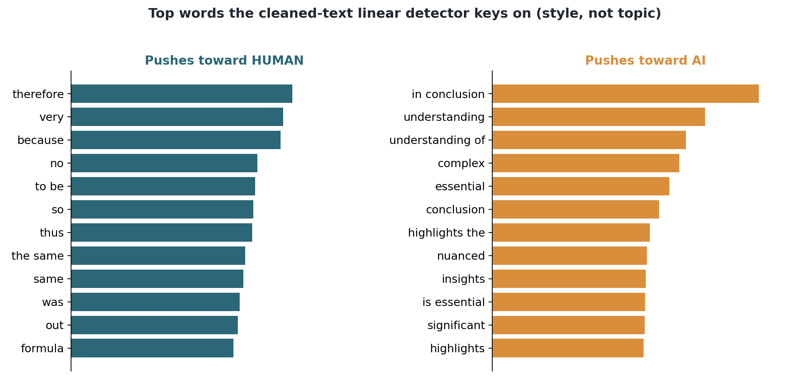
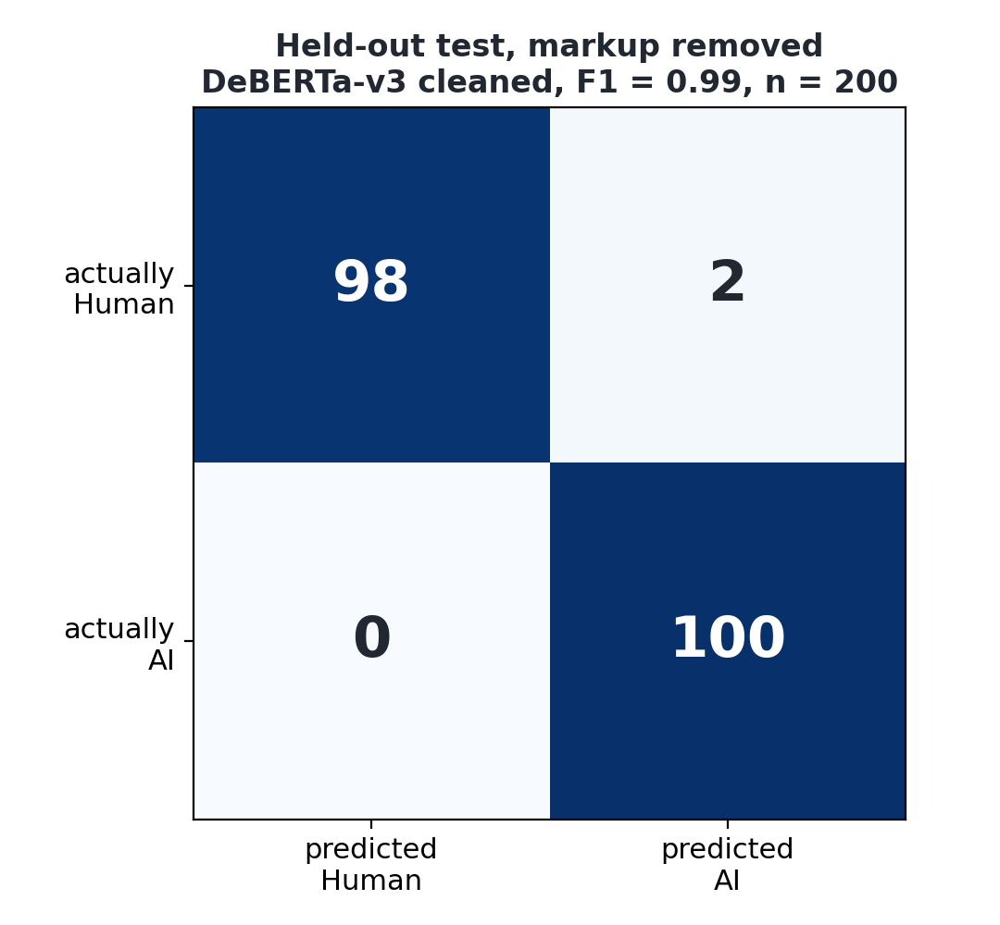
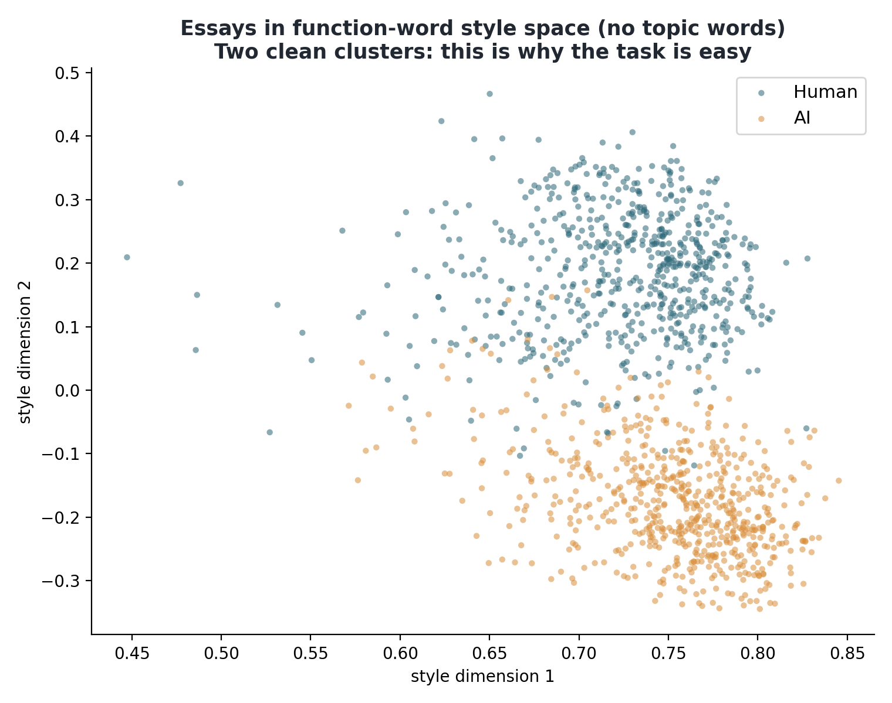

# Chapter 3: AI text detection (methodology and first results)

## 3.1 What this component has to do

The first stage of the pipeline decides whether a piece of submitted writing is the
student's own or was produced by a generative model. Everything downstream depends on it.
A bare score is not enough on its own, though, because the lecturer has to be able to defend
whatever decision follows from it. I am therefore as interested in why the model decides
what it decides as in how often it is right.

## 3.2 The detection corpus

I needed text that is labelled human or AI and that does not give the answer away for the
wrong reason. The human side is a stratified sample of 640 real student essays from BAWE
(Alsop and Nesi, 2009; the sampling is described in the sample design note). For the AI side I
generated one essay per human essay with Llama 3.1 8B (Grattafiori et al., 2024) running locally, matched on topic, keywords and target
length. The length matching is there because a detector faced with AI essays that ran
systematically longer or shorter could score well just by counting words, and would learn
nothing about style. After generation the lengths line up closely (Pearson r about 0.98
between each AI essay and its human source, mean length ratio about 1.05), so length carries
no usable signal in this corpus.

That gives 1,280 essays, 640 human and 640 AI. I split them by student rather than by essay,
so nobody appears in both training and test. Without that rule the model could memorise one
person's writing instead of learning the general difference between the classes. The split
is 438 / 102 / 100 pairs for train / validation / test.

## 3.3 The detector

For the detection model I fine-tuned two transformers with the same settings and the same
student-level splits: DeBERTa-v3-base as the primary model and RoBERTa-base as a comparison,
both classifying human (0) against AI (1). I report accuracy, precision, recall, F1
and the confusion matrix, plus a separate false-positive rate for native and non-native
English writers, because wrongly flagging a non-native student as AI is the failure mode I
most want to avoid. The second half of the hybrid, a stylometric feature model (perplexity,
burstiness, vocabulary richness, part-of-speech mix), is built in Chapter 5, and the two
halves are fused in Section 6.7. This chapter covers the transformer half on its own.

## 3.4 The first result and why it needed checking

The first trained detector scored a perfect F1 of 1.00 on the held-out test set, for both
DeBERTa and RoBERTa. A perfect score needed checking before I could use it. This project
argues that detection scores must be explainable, and presenting a number I could not
explain myself would undercut that. Before relying on the detector I ran an audit
(`src/detection/audit_detector.py`) to find out whether the score was real or a shortcut.

## 3.5 The audit

The audit covered four checks.

**Test-set contamination.** I checked that no student sits in more than one split,
that each human and AI pair stays in the same split, and that no exact-duplicate text crosses
from training into test. All three checks came back clean across 394 students, so the model
had not simply seen the answers.

**A giveaway in the text itself.** There is one, and it is the main finding of the audit. The
human essays come from the BAWE plain-text export, which keeps structural tags such as
`<heading>`, `<fnote>`, `<list>`, `<figure>` and `<quote>`. About 88 percent of the human
essays in my sample contain at least one of these tags. None of the AI essays do, because
Llama writes plain prose without corpus markup. A rule as simple as "if the text contains a tag, call
it human" reaches 92.5 percent accuracy on the test set on its own, with no understanding of
language at all. The AI side has a mirror-image problem: Llama sometimes
writes markdown (bold, headings, bulleted and numbered lists) that human plain text never
has. Both artefacts come from how each half of the corpus was produced, they say nothing
about the writing itself, and they sit right at the start of the text where the model's
512-token window sees them. This shortcut accounts for a large part of the perfect score.

**Whether anything real survives cleaning.** I wrote a normaliser
(`src/detection/text_normalize.py`) that strips the BAWE tags from the human side and the
markdown from the AI side and flattens the layout, then rebuilt the corpus from the cleaned
text. On the cleaned text a simple TF-IDF and logistic-regression model still separates the
two classes at 100 percent on the test set. I treat that 100 percent with some caution, because
one residual markup token ("fnote") survived the cleaning into the full model's vocabulary.
Tracing it showed why. The cleaning strips the bracketed tags, but 115 of the 640 AI essays
contain the bare word "fnote", echoed by the generator from keyword prompts that were extracted
from the human source text. In the cleaned corpus "fnote" therefore flips from a human marker to
a weak AI one. It is a generation artefact rather than leftover markup, and it does not touch
the function-word or stylometric results. To close the question I later ran the promised
control, with the bare token stripped from both classes and the same DeBERTa configuration
retrained on the same splits (`src/detection/fnote_control.py`, `outputs/fnote_control.json`).
The control scores F1 0.995 against the detector of record's 0.990, one test essay of
difference, so "fnote" was carrying nothing and the headline stands without it. The cleanest
evidence comes from a stricter test. A model that is allowed to use only
function words (the, and, because, therefore, and the like, which carry no topic information at
all, and no markup) still reaches 99.5 percent. Topic cannot explain that, and neither can a
leftover tag. The remaining signal is writing style.

**What the cleaned model keys on.** The cleaned linear model is interpretable, so I can read off
the words that push each way. The AI-leaning terms are the familiar large-model register: "in
conclusion", "nuanced", "essential", "highlights", "insights", "complex", "significant". The
human-leaning terms are blunter connectives: "therefore", "because", "so", "thus", "very".
That matches what the stylometric features already showed, that human writing here varies more
and the AI writing is smoother and more uniform.

## 3.6 Results on the cleaned corpus

After removing the artefact I retrained DeBERTa on the cleaned corpus. The score moved off
the ceiling, as I had hoped it would. Test accuracy is 0.99, precision 0.98, recall 1.00 and
F1 0.990, with a confusion matrix of [[98, 2], [0, 100]]. Two human essays are flagged as AI
and no AI essay is missed. The test set is small (100 human and 100 AI essays), so I put a
number on that uncertainty. A 95% bootstrap confidence interval on the F1 is about [0.97, 1.00]
(`src/evaluation/confidence.py`, Figure 3.5), and one extra misclassification moves the F1 by
roughly 0.005, so the headline should be read as "about 0.99" rather than an exact value. The
full-document linear probe still scores 1.00 on the same cleaned text while DeBERTa makes two
mistakes, which fits the fact that the transformer only reads the opening 512 tokens and the
linear model sees the whole essay.

On fairness, the human false-positive rate is 2 of 50 native writers (0.04) and 0 of 50
non-native writers (0.00). With only 50 humans per group, one essay is worth 0.02, so this is
not enough to establish a fairness gap, and I treat it as indicative only. The stronger fairness
evidence is the cross-domain result in Chapter 6, where the human false-positive rate is measured
on far more text and shows the real bias mechanism.

RoBERTa, trained the same way on the cleaned corpus, lands in the same place: F1 0.995, a
confusion matrix of [[99, 1], [0, 100]], native false-positive rate 0.02. Its only difference
from DeBERTa is one human essay flipping, and the two confidence intervals overlap almost
completely (Figure 3.5). On this 200-essay test set 0.990 and 0.995 are statistically
indistinguishable, so I do not read anything into the gap. Both architectures also make the
same kind of mistake: every error is a human essay flagged as AI, and no AI essay is missed.
That shared, one-sided error pattern matters more than the near-identical scores, because it
indicates that the residual signal is a real style difference and not a quirk of one model.

The cleaned F1 of 0.990 is the number I report; the raw 1.000 is kept only to show how large
the artefact was. Either way the in-domain task is easy, and the literature agrees:
separating one known generator from human writing in one domain is close to a solved problem.
That easy setting is not where this project makes its contribution. The contribution is the
explanation behind each decision and, after this stage, robustness to the harder settings that
matter in practice, meaning other generators, paraphrased AI text, and submissions that mix
human and AI writing. I expect the score to drop there, and those harder settings are where
the real research in this project takes place.

## 3.7 Why the score is still high after cleaning

A cleaned score of 0.99 could look suspicious in its own right, so I dug into the reasons
(`src/detection/why_high.py`) in order to answer the question properly. The score is high
because the task as I have built it is the easy version of the problem, and several separate
signals reinforce each other.

The biggest reason is that all of my AI text comes from one model with one prompt. The AI
class is really "Llama 3.1 writing the way I asked it to", so it has a consistent style. When
I measure how similar essays are to each other in style space, the AI essays are more alike
(average similarity 0.60) than the human essays (0.56). The humans are a crowd of different
people; the AI is one voice repeated 640 times. Separating one consistent voice from a varied
crowd is not hard, and the detection literature treats single-generator, in-domain detection
as close to solved.

Several smaller tells sit on top of that, all pointing the same way. The vocabulary differs
(the AI register described above). The spelling differs too: the human essays in my sample are
in British English (about 2.3 British spellings per thousand words) and Llama defaults to
American (about 2.4 American spellings per thousand words). This tell is real but shallow. It
is a generator-locale artefact rather than deep evidence of AI authorship, and it would shrink
if I prompted the model to write British English, a fix I will try. Formality differs as well:
the human essays use about three times as many contractions. None of these on its own is
decisive, but they stack. A 2D picture of the essays in pure style space (Figure 3.4,
function words only) shows two clouds that barely touch. Given how easy the setting is, 0.99
is the expected result, not evidence of a hidden error.

I checked how much of the separation rests on the shallow locale tell
(`src/detection/style_locale_control.py`). Removing every British and American spelling
variant and every contraction from the text changes 1,251 of the 1,280 essays, but the
function-words-only accuracy does not fall. It goes from 0.995 to 1.00, and the full TF-IDF
model stays at 1.00. The locale and formality tells are real, then, but the separation does
not rest on them; the distributional style signal is there with or without them. I keep the
locale point as a caveat and a planned fix, not as the explanation for the score.

The closest call came out reassuring. The human essay the model rates most AI-like scores 0.43
on the AI scale, so it is still correctly called human. The borderline cases are a small mix
of native and non-native writers, not a pile of non-native essays. A cluster of non-native
writing at the boundary was the bias I had been watching for, and it did not appear.

## 3.8 Where this chapter's threads are picked up

The audit also gives the explainability layer its starting point. The cleaned linear model can
already point at the words that drove a decision, a first concrete version of the explainable,
defensible evidence the later chapters develop. The attribution methods (Integrated Gradients,
SHAP and attention) are built and faithfulness-tested in Chapter 5, the M4 multi-generator and
cross-domain tests are in Chapter 6, and the stylometric features are fused with the
transformer into the hybrid detector in Section 6.7.
