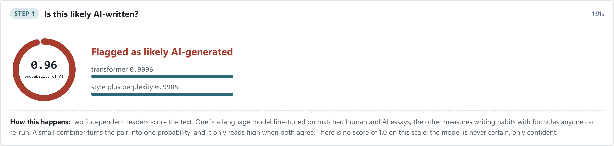

# Chapter 4: Methodology and implementation

## 4.1 Research approach

This project builds an artefact and then measures it. That choice follows from the research
question, which asks whether a pipeline of this kind can be designed at all and how far a local
model can go, not whether a stated hypothesis holds across a population. So the work proceeds in
the order build, measure, then decide what the measurement licenses me to say. Every component in
Chapter 1's scope was built, and none was carried forward on the strength of an argument that it
ought to work.

Three commitments shape the method, and each of them cost something.

The first is that no component is accepted on a number alone. Every automatic score in this
dissertation is anchored to something the models being scored cannot influence. Question quality is
measured by a simulation whose outcome depends on the source text rather than on anyone's opinion,
and the LLM judges are then checked against that simulation instead of being trusted on their own
(Section 8.7). The reason for the commitment is on the record in this document three times over: a
detector that scored perfectly turned out to be reading formatting rather than writing, a fine-tune
that beat everything turned out to be producing unusable questions, and a judge panel that agreed
with itself turned out to disagree with the measurement. Each was caught by a check, and each check
is described where it applies rather than gathered into a methods appendix, because the point is
that the checking is part of the work rather than a stage at the end.

The second is that comparisons are made like for like. When the question-generation backends were
first compared, each chose its own claims, and the commercial model held a small advantage. Holding
the claim set fixed across every writer removed most of that advantage and showed it to have been
claim selection rather than question writing (Section 8.8). The general lesson governs the whole
evaluation: where two systems are compared, the task is held identical and only the system varies.

The third is that the corpus is constructed to remove shortcuts rather than to flatter the
detector. The AI essays are matched to the human ones on topic and length, the same cleaning is
applied to both classes, and the splits are made at writer level so no author appears on both sides
of a split. Sections 4.5 to 4.7 give the detail. A detector that separates two classes because one
is longer, or because one carries markup the other does not, has learned nothing about writing, and
Section 4.9 is the account of exactly that failure being found and removed.

Where a design decision was forced rather than chosen, the chapter says so. The 8 GB memory budget
is the clearest case: it ruled out fine-tuning an 8B model, and the smaller model that replaced it
was approved on measured evidence rather than preference.

## 4.2 Ethics, data and licensing

The study involves no human participants. That was a deliberate scope decision taken with my
supervisor, and it is the reason no ethics approval was required. It also has a methodological
cost, which Chapter 9 states plainly: question quality rests on a simulation rather than on
students, so the discrimination scores are proxies and the classroom study is the first item of
future work.

Every dataset is public and openly licensed. BAWE is used under CC BY-NC-SA 3.0 for
non-commercial research. Its essays are real student work, so although the corpus is published, I
treat the text as material to compute over rather than to republish: no essay text is committed to
the repository, and the appendices quote only short illustrative fragments. The AI counterparts
were generated locally, so producing the matched corpus sent no student writing to any third party.

That constraint shaped the system as well as the study. Because a submission is personal data, the
pipeline was built to run end to end on one machine, and the local-versus-commercial comparison in
Chapter 8 is what makes that practical rather than merely preferable. An institution can run the
whole process on hardware it already owns.

The last ethical point is about what the output is allowed to be. A detector that falsely flags
human academic writing 79 percent of the time in an unfamiliar domain (Section 6.3) cannot be the
end of a disciplinary process, and the literature reports the same failure landing unevenly on
second-language writers. The design answer runs through the whole pipeline: a flag opens a
conversation and never closes one. The guide is written as evidence for a discussion with the
student, every question is traceable to sentences the student wrote, and the system offers no
verdict of its own.

## 4.3 Environment and reproducibility

The whole project runs on my own laptop. After Meeting 3 it became clear that no ATU HPC or
cloud would be available, so every part has to fit a single RTX 4060 with 8 GB of VRAM, or fall
back to the CPU. Most of the choices below follow from that limit, including the use of
base-sized models instead of large ones.

The stack is Python on Windows, with PyTorch and the Hugging Face libraries for the transformer
work, spaCy for the linguistic features, and scikit-learn for the simpler baselines and the
audit probes. To keep runs repeatable I set a single random seed (42) everywhere that randomness
enters: the sampling, the train and test split, and the model training. Dependency versions are
pinned. The work is committed to a local git repository in small steps with clear messages, so
any result can be traced back to the exact code that produced it. Long jobs (essay generation,
model training) are launched as detached background processes instead of being tied to an open
terminal session, so they keep running if the session that started them closes. This sounds like
a small detail, but it cost me two failed generation runs before I worked it out, and it is now
the standard way I start anything that takes more than a few minutes.

## 4.4 Data acquisition and cleaning

The human side of the corpus comes from the British Academic Written English (BAWE) collection
(Alsop and Nesi, 2009), which I downloaded from the Oxford Text Archive. A first script
(`src/data/explore_bawe.py`) reads the holdings spreadsheet, prints a summary, and cross-checks
the recorded word counts against a plain count of the text files so I know the metadata is
trustworthy. A second script (`src/data/clean_bawe.py`) produces a cleaned metadata table,
dropping a row that was labelled twice. Every later step samples from the cleaned table.

## 4.5 Sampling

The sample is drawn by `src/data/build_sample.py`. I stratify evenly across the four broad
disciplinary groups rather than by named discipline, and I balance native against non-native
English writers so that I can later test whether the detector is unfair to non-native writers.
A per-student cap stops any one person's style from dominating. The train, validation and test
split is made at the level of the student, not the essay, so the same writer never appears on
both sides of the split. The result is 640 human essays with a versioned manifest
(`bawe_human_sample_manifest.csv`) that records, for each essay, its group, first-language
status, and split. The reasoning behind the sizes is written up in
`dissertation/sample_design.md`.

## 4.6 Generating the matched AI essays

`src/generation/generate_ai_essays.py` builds the AI half of the corpus. For each human essay
it generates one AI essay on the same topic and at the same target length, using Llama 3.1 8B
running locally through Ollama. Matching on length and topic was the part I took most care over.
An AI half that ran systematically longer or shorter, or that drifted onto different subjects,
would let the detector separate the classes for the wrong reason, and the whole corpus would be
invalid.

The matching works through the prompt and a length loop. The prompt is anchored on keywords
pulled from the human source text, not just the essay title, after an early test with a title
alone produced an off-topic essay. The generator also runs a short continuation loop. If the
first draft falls short of the target length, it asks the model to continue, up to a few rounds,
so the AI essay lands close to its human counterpart. The script is resumable, so a run that
stops can be restarted and it skips what is already done, and it keeps the machine awake while
it runs. Each essay goes to disk along with a metadata row recording the target and actual
length, the number of rounds, and the time taken.

Generation of all 640 essays completed locally with no failures. A validation script
(`src/generation/check_ai_corpus.py`) confirmed the match: the correlation between each AI essay
and its human source length is about 0.98, the mean length ratio is about 1.05, and over 99
percent of AI essays are within 20 percent of their source length. A keyword spot-check
confirmed the AI essays stayed on the same topics. The detector needs the two halves to differ
only in the writing, and on these checks they do.

## 4.7 Building the labelled corpus

`src/detection/build_detection_corpus.py` pairs each human essay (label 0) with its matched AI
essay (label 1), carries the split and metadata across from the manifest, and writes a single
table of 1,280 rows. The same script has a cleaning mode (described in Section 4.9) that strips
markup before writing, so the raw and cleaned corpora can be compared directly.

## 4.8 The detector

Detector training lives in `src/detection/train_detector.py`, which uses the Hugging Face
Trainer to fine-tune a transformer to classify human against AI. DeBERTa-v3-base is the primary
model and RoBERTa-base the comparison. To fit the 8 GB card I keep the per-step batch small and
use gradient accumulation to reach a sensible effective batch, with mixed precision on the GPU.
The script reports accuracy, precision, recall, F1 and the confusion matrix. It also breaks out
the false-positive rate for native and non-native writers separately, and the fairness analysis
later builds on that breakdown. The stylometric feature extractor
(`src/detection/stylometric.py`) computes the linguistic features (sentence-length variation,
vocabulary richness, part-of-speech mix, and so on). Those features are fused with the
transformer into the hybrid detector in Section 6.7 (`src/detection/hybrid_fusion.py`).

## 4.9 The audit and the cleaning step

The first detector scored a perfect 100 percent, which I did not trust. Before accepting it I
ran an audit, implemented in three small scripts, and I count those scripts as part of the
contribution.

`src/detection/audit_detector.py` runs the diagnostic battery: it confirms there is no student
or duplicate-text leakage across the splits, measures how much of the score a markup-only rule
can reach on its own, and trains simple interpretable baselines on raw and cleaned text,
including a function-words-only model that removes all topic information.
`src/detection/text_normalize.py` is the cleaning function the audit relies on. It strips the
BAWE export tags from the human text and the markdown from the AI text, and flattens the
layout, so that whatever difference remains comes from the writing and not the formatting.
`src/detection/why_high.py` then explains why the cleaned score stays high. It measures locale
spelling, contraction use, and how tightly the AI essays cluster in style space, and it draws
the two classes in a two-dimensional style projection.

The finding, covered in Chapter 3, was that the original human text carried structural tags
that no AI essay had, and that this shortcut accounted for a large part of the perfect score.
The cleaning step removes the shortcut. The detector is then retrained on the cleaned corpus,
and the retrained score is the headline figure I report.

## 4.10 Engineering notes and lessons

A couple of practical points from this phase belong in the methodology. One is launching long
jobs as detached processes, which is what finally made the overnight generation reliable. The
other is the markup artefact itself. It shows why a strong result has to be stress-tested
before it is believed, and because the audit is scripted, anyone can rerun it and see the same
thing. Both points feed into how I will build and check the remaining components.

## 4.11 The lecturer-facing interface

Everything above is a set of scripts. A lecturer is not going to run scripts, and a component that
only a researcher can operate has not really been shown to work for the person it was designed for.
So the pipeline is also wrapped in an interface that a lecturer can use directly, in `src/webapp/`.
It matters to the argument as well as to the demonstration: the case this dissertation makes is
that a flag is only useful if a lecturer can inspect and defend it, and inspecting it is something
you do by clicking, not by reading a log file.

### What it does

The interface is a local web application. `src/webapp/server.py` is a small FastAPI service and
`src/webapp/static/index.html` is a single self-contained page. There is no build step, no
framework and no external asset, which keeps the whole thing readable and means it will still run
in a few years when the frameworks of 2026 have moved on.

Figure 4.1 shows the page as it opens. Paste a submission and press one button, and it works
through five stages in order, each appearing as it finishes rather than after a single long wait. The stages are the pipeline itself:
the hybrid detector's verdict, the writing-habit explanation, the position of those habits in the
distribution of real student essays, the sentence-level occlusion marks, and finally the claims and
the questions drawn from them.

Every stage carries a plain-language panel headed "How this happens", which says what the
computation was and what it does not license. That is a deliberate design choice rather than
decoration. The complaint that runs through Chapter 2 about commercial detectors is that they hand
a lecturer a number with nothing behind it, and an interface that did the same would be repeating
the mistake with a nicer typeface.

### Stage one: the verdict, with its two readers separated

The fused probability is shown as one number, but the two component scores are shown as well
(Figure 4.2). The
hybrid of Section 6.7 only reads high when both readers agree, and a lecturer who can see the
components can tell the difference between a confident agreement and a fused score being carried by
one model. The dial never reaches 1.0, and the panel says so in as many words: the model is
confident, not certain, and an interface that displayed a round 100 percent would be making a claim
the evidence does not support.

### Stage two: the explanation that passed the faithfulness test

Figure 4.3 is the habit card of Section 5.7. It is worth saying plainly why the interface does not
do the thing people expect, which is to highlight the individual words that gave the essay away. That
explanation was built, tested against the ERASER-style ablation in Chapter 5, and failed: removing
the top attributed tokens barely moved the detector's confidence. Offering it anyway would have
made the interface more impressive and less honest. The habit card is what survived the test, so
the habit card is what the interface shows.

### Stage three: how unusual, not just whether unusual

The habit card answers whether a measurement is outside the normal range. The percentile view in
Figure 4.4 answers by how far, which is the question a lecturer defending a decision will actually be asked. The panel
also states the thing that keeps this from being over-read: one measurement in the top 5 percent
means nothing, since by definition one essay in twenty is in the top 5 percent of any measurement.
Several at once is the pattern worth attention. Unusual writing is not misconduct, and the
interface says so on the same screen that reports the percentiles.

### Stage four: which sentences, and what a sentence is worth

The marks themselves are shown in Figure 4.5. Clicking any marked sentence opens an evidence panel,
and this is the part of the interface that took the most iteration, because the first version simply reported that a sentence had the largest
effect on the score, which is true and useless. A lecturer looking at a highlighted sentence needs
three things: what is actually known about it, why that matters, and what to do next.

The panel is shown in Figure 4.6, and its wording changes with the size of the effect. Above two percent of the total signal
it says the sentence carries a lot for one sentence; below half a percent it says outright that the
sentence proves nothing on its own. In the example shown the top-ranked sentence accounts for 0.12
percent of the signal, and the panel says so rather than letting the highlight imply more. Every
panel ends the same way: the sentence is a place to begin a conversation, not a finding.

### Stage five: the questions, with their provenance

Figure 4.7 shows one claim card. The claim extractor keeps the sentence numbers each claim came
from, and the interface uses those numbers to look the quotation up from the submitted text. The model never supplies the quotation,
which means a hallucinated quotation is not possible here by construction rather than by good
behaviour. Each question carries a Bloom's level from the classifier of Section 7.5.

### Two additions that came out of using it

Two features were added after working with the interface rather than from the original design, and
both earned their place.

The first is a comparison mode: two submissions analysed side by side, through the same models, with
their habit measurements and percentiles shown against each other. This is the check that makes the
whole page defensible. If a submission the lecturer knows to be genuine sits at the same extremes as
the flagged one, then the flag is describing the genre or the subject rather than the author. That is
exactly the failure mode Chapter 6 measures across disciplines, and the interface gives a lecturer a
way to test for it on their own module rather than trusting my numbers.

The second is a counterfactual on the sentence stage. After the marks are drawn, the system removes
the highest-ranked sentences and re-scores what is left. If the verdict survives having its
strongest evidence deleted, the flag is a property of the whole submission rather than of a handful
of sentences, and a lecturer can say that with a number behind it.

### Making it correct, and making it fast

Two requirements pull against each other here. The interface must give the same answers as the
batch scripts the dissertation reports on, or the two would disagree and one of them would be
wrong. It must also respond quickly enough to be worth using.

Correctness is handled by wiring the interface to the same trained artefacts, not to a
reimplementation. On the worked pair it reproduces the reported figures exactly: the AI-written
version scores 0.9572 and is flagged, the real student essay scores 0.0234 and is not.

Speed was the harder half. The batch scripts load every model on each call, which is fine for an
overnight job and hopeless for an interface. `src/webapp/pipeline_service.py` holds one copy of
each model in the process and reuses it across requests, behind a lock so that two requests cannot
race into loading the same model twice. Startup pays about 27 seconds once, and a detection then
takes roughly two seconds on the laptop. The question stage is slower, around a minute, because it
runs a language model, and the interface says so before it starts rather than leaving the reader
watching a spinner with no explanation.

One limit is enforced rather than papered over. A submission under 120 words is refused, because
below that the writing-habit measurements are unstable, and reporting them anyway would be exactly
the unearned confidence this project is arguing against.

### What it demonstrates

The interface is not a research contribution in itself. It matters for two reasons. It shows the
pipeline running end to end on arbitrary text rather than on a curated example, which is a claim
this dissertation would otherwise be asking the reader to take on trust. And it holds the argument
about local models to account: the page is served from `127.0.0.1`, every model runs inside that
process, and the analysis still completes with the network disconnected. The case for running this
pipeline on a laptop instead of an API rests on student submissions being personal data, and the
interface is where that stops being an argument and becomes a property you can check.
