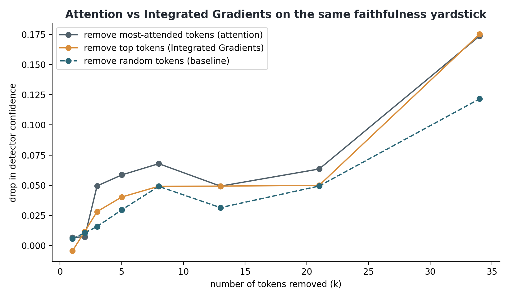

# Chapter 5: Explaining the detector's decisions

## 5.1 What this chapter does

A detector score on its own does not give a lecturer much to work with. If the system flags an
essay, the lecturer needs to see why it was flagged, and needs some assurance that the stated
reason is real. This chapter builds the first version of the explainability layer. It shows which
parts of an essay drove the decision, and it then tests whether that explanation is faithful,
which means whether the words it points to are actually the words the model used.

## 5.2 Token attributions with Integrated Gradients

For the word-level view I used Integrated Gradients, a standard attribution method, through the
Captum library (`src/explainability/integrated_gradients.py`). It works on the detector's word
embeddings and measures how much each token pushes the decision toward the AI class, compared to
a neutral baseline where the content is removed. I attribute everything to the AI class so the
sign is consistent. A positive score pushes toward AI, a negative score pushes toward human.

Figure 5.1 shows this for a matched pair, the AI and human versions of the same essay. The
detector is confident and in the right direction for both (the AI essay scores 1.00 on the AI
scale, the human essay 0.01). The heaviest tokens are punctuation and very common words and
word-fragments: full stops, commas, a dash, words like "have", "be", "can", "similarly". Topic
words barely feature. This matches what the audit found. The model reads style and rhythm, the
small machinery of how a sentence is put together, more than it reads what the essay is about.

## 5.3 Testing the highlights for faithfulness

Highlights can look convincing without reflecting what the model actually used, so I tested them
by ablation in the style of the ERASER benchmark (DeYoung et al., 2020), in the same script. For
a sample of test essays I ranked the tokens by their attribution and ran two checks.
Comprehensiveness asks whether removing the top tokens lowers the detector's confidence, and
whether it lowers it more than removing the same number of random tokens. Sufficiency asks
whether keeping only the top tokens and hiding the rest is enough to hold the confidence up.

Figure 5.2 shows the comprehensiveness result as more and more tokens are removed. Removing the
top-ranked tokens does hurt the detector more than removing random ones, but only by a little,
and only once a fair number are removed. The comprehensiveness sweep is the part of the test I
rely on. I also ran the sufficiency check (keep only the top tokens, hide the rest), but with at
most a few dozen of 256 tokens kept the model sees almost nothing and sits at a coin-flip for
every k. That flat line is an artefact of feeding the model near-empty input, so I do not treat
it as a finding. The comprehensiveness result on its own shows that no small set of words carries
the decision.

## 5.4 The signal is diffuse

This is a negative result, but a useful one. A few words cannot explain the decision because the
difference between human and AI writing here is spread across the whole essay, in the ordinary
words and the punctuation. There is no handful of give-away terms to point at. The audit found
the same thing from the other direction: a model using only function words still separated the
classes at 99.5 percent, and the essays form two clean clouds in pure style space. A diffuse
signal is hard to summarise with a word-level highlight, so for this detector a per-word heatmap
is a weak explanation on its own.

The feature-level explanation is the one that holds up for this detector. The interpretable
linear view from the audit (Chapter 3) names the style markers that separate the classes, the
large-model register on one side and the blunter connectives on the other, and the
function-words-only result backs that view up. For the lecturer-facing output I therefore lean on
the style and feature picture, together with the source-grounded verification questions that come
later in the pipeline. A single highlighted sentence would be a weaker basis.

## 5.5 Stylometric features and SHAP

To make the feature-level explanation concrete I built a detector from hand-crafted style
features alone, with no transformer: sentence-length variation and burstiness, vocabulary
richness, word length, punctuation, and the part-of-speech mix
(`src/explainability/shap_stylometric.py`). Trained on the same student-level splits, this
transparent model reaches an F1 of 0.985 on the test set (95% bootstrap confidence interval about
[0.97, 1.00], and identical, 0.985, across five training seeds, so it is stable). The comparison
with the transformer's 0.99 is not quite like for like, because the feature model reads the whole
essay while DeBERTa reads only the first 512 tokens. That helps the feature model, so I describe
the two as "competitive" rather than "equal". The false-positive rate of 0.02 for native and
non-native writers also needs care. It works out at one essay in fifty each, too small a base for
any fairness claim; the cross-domain result in Chapter 6 is the real fairness evidence. Two of
the features (type-token ratio and the rare-word ratio) are length-sensitive, but since the essay
lengths are matched across the classes this carries little class signal, and the length-robust
vocabulary measure behaves the same way. Perplexity, one of the strongest stylometric signals in
the literature, needs a GPU pass and joins the feature set when the hybrid is assembled in
Section 6.7, where it proves to be the strongest single feature. Even with these caveats, a
handful of interpretable features captures the signal almost as well as a large model does.

Because the model is built from named features, I can explain it faithfully with SHAP, which
attributes each decision to the features that drove it. Figure 5.3 shows the picture across the
test set. Longer words and a denser use of auxiliary verbs push a text toward AI. More
sentence-length variation, richer vocabulary, and more rare one-off words push it toward human.
This is the kind of explanation the project needs. A lecturer can be told that a piece was
flagged because its sentences are unusually uniform, its words longer, and its vocabulary less
varied than a typical student's, and the account is faithful because the model literally uses
those features. A black-box percentage gives the lecturer none of that.

This stylometric model is also the non-transformer half of the planned hybrid detector, so this
step serves both the explainability layer and the detector itself.

## 5.6 Attention visualisation on the same test

Attention visualisation is the third of the three methods named for the explainability component
(`src/explainability/attention_viz.py`). I use the standard view: how strongly the classifier
position attends to each token in the final layer, averaged over heads. This is the view often
presented as "what the model looked at". On the matched pair from Section 5.2 it produces a
plausible-looking picture (Figure 5.4). In the AI essay the most-attended token is an em dash,
followed by content words like "extract" and "poetry". In the human essay the attention mass sits
on ordinary function words like "the", "as" and "is". The em dash detail also fits the
stylometric results, since dash-heavy punctuation is one of the register markers the feature
model picks up.

A plausible-looking picture can still be unfaithful, and attention weights have a reputation for
being poor guides to what actually drives a decision. I therefore ran the same ablation protocol
as in Section 5.3, keeping the test sample, the seed, and the k-sweep unchanged, so all three
methods can be compared on one measure. Attention lands almost where Integrated Gradients does
(Figure 5.5). Removing its top 34 tokens drops confidence by 0.17 against 0.12 for random tokens,
a ratio of 1.43 to IG's 1.44. Keeping only its top tokens leaves the detector near a coin flip
(sufficiency around 0.53), just as it does for IG. At small k attention is even marginally ahead
of IG, but neither method's top tokens come anywhere near sufficient to carry the decision.

Measuring the third method leaves the conclusion where it was. Attention and Integrated Gradients
agree with each other, and both are weakly faithful because the style signal is spread across
many ordinary tokens. SHAP over the named stylometric features passes its ablation test and stays
as the explanation shown to lecturers. Having the third method measured still adds something.
Two independent token-level techniques fail the same test in the same way, so the weakness
belongs to token-level explanation on this task rather than to any one attribution method.

## 5.7 A lecturer-facing explanation card

The SHAP beeswarm of Figure 5.3 is the faithful explanation, but it is a researcher's picture.
It takes training to read, and the audience for this system is a lecturer with none. My
supervisor's feedback on the mid-project presentation made the same point, that the explanations
convince the person who built them and not yet the person who must use them. So I added a second rendering aimed at that
reader (`src/explainability/explain_submission.py`), and it is now part of every generated guide.

For one submission, the card takes the same style model the hybrid detector uses, computes which
habits moved this particular essay's score, and states each one as a plain sentence with its
number set against what is typical for real student essays in the corpus: "the sentences are
unusually uniform in length, variation 7.5 against a typical 11.4", "a language model finds this
text unusually easy to predict, surprise score 18 against a typical 30". Each sentence ends with
the direction it pushed, and the picture beside them shows each habit as a dot on a strip: a grey
band marks the middle 80 percent of real student essays, a line marks the typical value, and the
dot marks this essay, coloured by the direction it pushed. For a flagged AI essay every dot sits
outside the band; for its human twin the dots sit inside it. Position on a range needs no
statistics to read, which is the point. The wording is generated from the numbers themselves
(higher or lower than the human median), so a sentence cannot contradict its own figures. The card also explains the very model
that produced the score rather than a simplified stand-in, so the faithfulness shown in Section
5.5 carries over without needing a new argument.

The explainability work is not finished here. The card has not yet been tested on actual
lecturers, and its reference band is one corpus's idea of "typical". The transformer half's
per-essay account is taken up next, in Section 5.8, and the answer it gives is not the one I
went looking for. From this point on, any explanation the system shows has to pass two checks,
the ablation test for faithfulness and a plain-reader test for whether it is understood.

## 5.8 Sentence-level occlusion: a reliable ranking of nothing in particular

One route to a per-essay transformer account remained untried: occlusion at sentence level.
Delete one sentence at a time, measure how the log-odds of the AI class move, and rank the
sentences by the drop (`src/explainability/sentence_occlusion.py`,
`outputs/sentence_occlusion.json`). Occlusion is faithful by construction, since it reports what
the model actually did when the text changed, and a sentence is something a lecturer could quote.
The measurement runs in log-odds because the in-domain detector saturates near probability 1.0,
where sentence-sized changes vanish below rounding.

The test mirrors Section 5.3 at the new granularity: on thirty test AI essays, remove the three
top-ranked sentences together and compare the drop with removing three random sentences. The
ranking turns out to be real. Targeted removal beats random on 27 of the 30 essays (Wilcoxon
p < 0.001), and random removal does nothing at all (mean drop -0.001 log-odds). At sentence
level the model's preferences can be recovered reliably, which token attributions could not
manage (Figure 5.6).

The magnitude is the other half of the answer, and it is the half that matters. The mean drop
from removing the three most machine-like sentences is 0.011 log-odds, against a full-essay
log-odds around 7.9: about 0.14 percent. Deleting the strongest evidence the ranking can find
leaves the decision untouched. There are no flag-carrying sentences to point at, because the
style signal is spread through essentially every sentence, which is the same diffusion the
token-level analysis saw, now measured at the scale a lecturer would want to quote. This
settles a design question with data. A "these sentences drove the flag" section in the guide
would rank correctly and still mislead, implying the flag rests on quotable passages when
removing them changes nothing, so the guide does not get one, and the habit-level card stays
the per-essay explanation for a measured reason rather than a preference. The ranking keeps one
narrow legitimate use: choosing which passages to quote as illustrations of the habits the card
names, never as causes.

## 5.9 Next steps for explainability

The stylometric model and the transformer are fused into the hybrid detector in Section 6.7, with
perplexity added to the feature set. The token attributions stay in as a supporting visual,
useful for showing a lecturer roughly where the model looked, always paired with the caveat from
the faithfulness test and with the SHAP feature view as the primary explanation. The faithfulness
check itself carries forward as a standard step, so any explanation the system shows is one I
have tested first.
