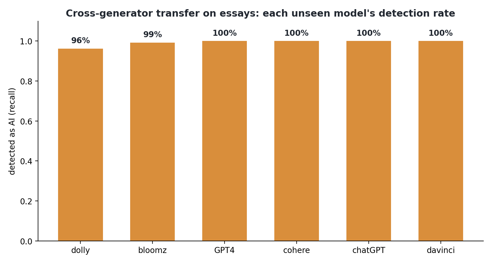
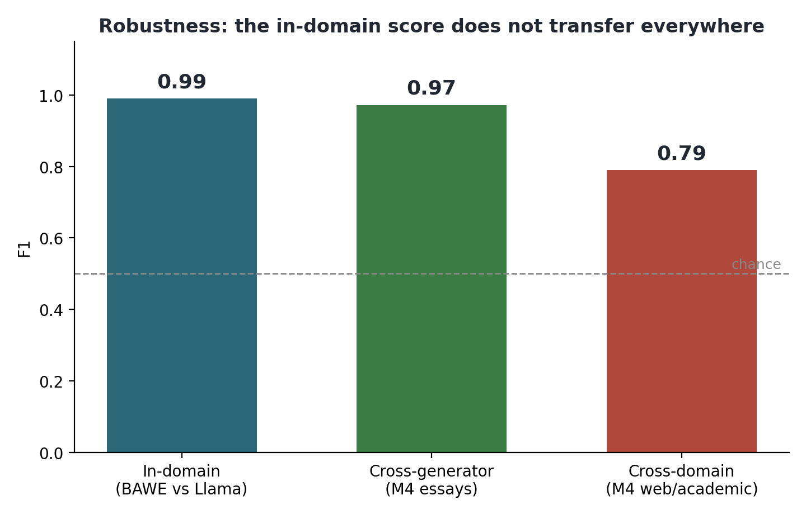
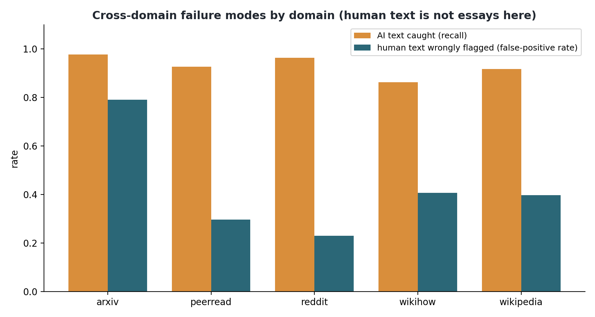

# Chapter 6: Robustness, transfer to unseen generators and domains

## 6.1 The question

The in-domain detector scores about 0.99. That score comes from an easy setting, one generator
(Llama) and one kind of text (student essays). This chapter asks what happens when neither holds.
I took the trained detector, with no retraining or adaptation, and ran it on the M4 benchmark
(SemEval-2024 Task 8), which has many generators and many domains the detector never saw. I split
the work into two tests so the easy half does not get labelled "robust" by accident.

A note on sources, because the two tests draw on different data. Test A uses the OUTFOX essay set
that ships inside the M4 release, human essays against six generators. Test B uses the M4 /
SemEval-2024 Task 8 monolingual data across five web and academic domains. I chose two different
corpora deliberately. Test A isolates a change of generator while holding the text type fixed
(essays). Test B changes the domain. Since they have different generator sets, I name them
separately instead of calling both "M4".

## 6.2 Test A: transfer to unseen generators (still essays)

The first test uses the OUTFOX essay set, where humans and six different models (GPT-4, ChatGPT,
Cohere, BLOOMz, Dolly, and davinci) all wrote essays. The kind of text stays the same as training;
only the generator changes. The detector held up well. F1 was 0.97 (95% confidence interval
[0.97, 0.98], on about 4,800 essays so the interval is tight), it caught every generator at
between 96 and 100 percent (Figure 6.1), and the human false-positive rate was about 5 percent.
The result is useful and it surprised me a little. A detector trained only on Llama still
recognises text from quite different models. Current large models share a lot of the same smooth,
uniform style, so the AI fingerprint largely carries across generators, at least on essays.

## 6.3 Test B: transfer to unseen domains

The second test is the hard one, on the M4 monolingual data. Here the human text is not essays at
all. It is Reddit posts, WikiHow articles, arXiv abstracts, Wikipedia, and peer-review text, set
against four generators. The overall F1 falls to 0.79 (95% confidence interval [0.77, 0.80], tight
because the sample is large). The generator set here differs from Test A, so the headline drop
mixes a change of domain with a change of generators. For that reason I treat the human side of
the result as the stronger evidence, because a false-positive rate measured on human text cannot
be a generator artefact. The detector still catches the machine text well in every domain (86 to
98 percent). The failures are on the human side. The detector wrongly flags genuine human writing
as AI at high rates on the more formal domains: 79 percent on arXiv abstracts, about 40 percent on
Wikipedia and WikiHow, 30 percent on peer-review, and 23 percent on Reddit (Figure 6.3). Figure 6.2
puts the three settings together, so the in-domain score, the transfer across generators and the
drop across domains can be compared on one axis.

## 6.4 What this means

Taken together, the two tests show a detector that transfers across AI models and fails across
domains, and the failure has a pattern. The model learned that "human" looks like a student essay.
When it meets human writing that is more formal or more technical, an arXiv abstract for example,
it calls it AI. So the out-of-domain failure is a false-accusation failure, the harm the project
set out to avoid.

This connects to the fairness concern from the start of the project. A detector trained on one
narrow idea of human writing will misjudge writers whose style sits outside that idea. The arXiv
result shows this most clearly, since formal, dense, careful human prose reads as machine to this
model. The same mechanism makes these tools risky for non-native writers, whose style also differs
from the training norm. It is also the strongest reason the pipeline does not stop at a score. A
number that is confidently wrong on a whole domain is dangerous on its own. The verification
questions give a lecturer something to check before acting on a flag.

## 6.5 Caveats and next steps

This is a zero-shot test with no adaptation, so it is a lower bound on what is achievable. A
detector trained on diverse human text and several generators would almost certainly do better
across domains, and that is a clear next experiment (train on a slice of M4 and re-test). The
false positives trace back to the in-domain "human" class being essays, so the fix is more varied
human data and per-domain calibration. The remaining robustness gaps to test are paraphrased and
"humanised" AI text, and documents that mix human and AI writing. As the project stands, the
detector is good at spotting AI essays from many models. It is not safe to point at human writing
from a domain it was not trained on.

## 6.6 The natural-distribution control

One design worry from Meeting 2 with my supervisor stayed open until now. The detection corpus is
deliberately balanced, with equal essays per disciplinary-group-by-native cell, but real
submissions look nothing like that. In the full BAWE corpus, native Arts and Humanities writers
supply about 21 percent of essays and non-native AH writers about 4 percent. If the detector's
strong results depended on the artificial structure, the whole evaluation would be over-fitted to
a corpus shape that never occurs in practice. To check, I trained two detectors in parallel from
the same cleaned corpus with identical hyperparameters, seeds and size (247 human essays each,
plus their matched AI twins). They differ only in writer mix: one balanced (31 per cell), one
matching full BAWE's natural skew (53 native AH essays down to 10 non-native AH). Both are
evaluated on the same untouched test split, per cell, reweighted to the natural proportions, and
with the fairness read (`src/evaluation/balanced_vs_natural.py`, `outputs/balanced_vs_natural.json`).

The balancing turns out not to matter (Figure 6.4). The two models score identically, F1 1.000
overall, in every cell, and under natural reweighting. They make the same prediction on every one
of the 200 test essays (zero disagreements, McNemar p = 1.0), with a zero false-positive rate on
human essays in both native-language groups. Given Chapter 3 this is unsurprising. The cleaned
corpus is separable on function words alone, so 494 training essays saturate the test set
regardless of how their writers are distributed. On the reassuring side, the balanced design did
not manufacture the result, because a realistically skewed training mix reproduces it. That
answers the Meeting 2 worry. The caveat is that at this level of separability the comparison has
no resolution. Whether balancing helps or hurts can only be measured where the task is hard.

So I ran the same two models where the task is hard: the cross-domain sample from Section 6.3,
identical texts, identical seed (`src/detection/dist_crossdomain.py`,
`outputs/dist_crossdomain.json`). Here the control finally has resolution, and it splits cleanly
in two (Figure 6.5). On overall skill the mixes still do not differ: accuracy 0.801 against
0.800, and on the same texts each model uniquely gets about as many right as the other (118
against 115, McNemar p = 0.90). On false accusations they do differ. The balanced model wrongly
flags 20.1 percent of the out-of-domain human texts against the natural model's 16.7, and the
paired counts are lopsided enough to be clear: 78 human texts are flagged only by the balanced
model against 27 only by the natural one (McNemar p < 0.001), with the gap concentrated in
WikiHow and Wikipedia and a small lean the other way on arXiv. A plausible mechanism, offered as
a hypothesis rather than a finding, is that balancing doubles the weight of non-native writing,
whose flatter, more uniform style sits closer to machine text on exactly the features Chapter 5
identifies, narrowing what the balanced model accepts as human. Whatever the cause, the practical
reading is honest on both sides. The balancing did not manufacture any result and costs nothing
in accuracy, but it is not free either: out of domain it makes the detector slightly more willing
to accuse, which is the direction this dissertation cares most about. A deployment that trains on
a curated mix should re-check its false-positive behaviour on unfamiliar text rather than assume
balance is automatically the safer choice.

## 6.7 The hybrid detector

The first component in the scope is a hybrid, the transformer combined with the stylometric
features, including the GPT-2 perplexity signal (Radford et al., 2019) that Chapter 5 deferred
because it needs a GPU pass. Both halves have existed for some time at 0.990 and 0.985 in-domain,
so assembling the hybrid was never going to move the headline number. After the results above, the
question I cared about was whether fusion changes the detector's behaviour where it fails. The
assembly is simple. Perplexity joins the feature set, the feature model is retrained, and a
logistic regression fuses the two models' probabilities. The regression is fitted on the
validation split so the test set stays untouched, then applied zero-shot out of domain
(`src/detection/hybrid_fusion.py`, `outputs/hybrid_fusion.json`).

In-domain, everything sits at the ceiling. Adding perplexity lifts the feature model from 0.985 to
1.000 on the 200-essay test split, and the hybrid scores the same. Two essays' worth of movement
separates all the arms, so these differences should not be over-read. One detail is worth keeping.
Perplexity enters the feature model as its strongest single feature, first of twenty-five by mean
absolute SHAP. That matches the literature's regard for it, and it completes the feature set the
scope specified.

Out of domain the fusion matters (Figure 6.6). On the same cross-domain sample as Section 6.3, the
three arms have almost identical F1 (transformer 0.790, hybrid 0.791), but they make completely
different errors. The transformer over-flags humans, with recall 0.93 at precision 0.69, the
false-accusation profile from Section 6.3. The style-plus-perplexity model errs the other way,
precision 0.82 at recall 0.72. The fusion balances the two (precision 0.80, recall 0.78) and lifts
accuracy from 0.753 to 0.794. The larger effect is on the human false-positive rate, which falls
in every domain: from 0.79 to 0.61 on arXiv abstracts, 0.30 to 0.09 on peer reviews, 0.23 to 0.05
on reddit, 0.41 to 0.10 on wikihow and 0.40 to 0.12 on wikipedia. In four of the five domains
false accusations drop by a factor of three to eight. arXiv remains the hard case, better but not
fixed. The style features drive the improvement, because hand-crafted features generalise across
registers while the transformer's learned representation of "human" stays anchored to student
essays.

This connects back to the mitigation plan in Section 6.4. Fusion does not solve domain shift, and
the headline F1 barely moves, so it is not a robustness cure. It redistributes the remaining
errors away from falsely accusing human writers, the direction a deployed system must err in, and
the cost is a feature extractor that runs anywhere. Component 1 of the scope is now complete as
specified. The rest of the pipeline should call the hybrid rather than the bare transformer.

## 6.8 Measuring the abstain band

Sections 6.4 and 9.5 propose an abstain band as a deployment safeguard. When the hybrid's
probability falls in a middle band, the system says "uncertain" instead of flagging. This section
measures what that buys. On the same cross-domain sample as Section 6.7, keeping the per-text
hybrid probabilities this time, I swept bands from none to 0.2-0.8
(`src/detection/abstain_band.py`, `outputs/abstain_band.json`).

Part of the answer matches the proposal (Figure 6.7). Accuracy among the texts the system still
judges climbs steadily, from 0.79 with no band to 0.88 when the widest band declines 28.5 percent
of texts. Abstention does concentrate the detector's verdicts on cases it gets right. But the
human false-positive rate among judged texts barely moves. It sits near 0.19 across the whole
sweep. The false accusations that survive the hybrid sit far from the threshold. They are
confident errors, mostly the dense arXiv abstracts that the detector scores as machine-like with
conviction, so an uncertainty band never sees them. I had expected the band to cut false
accusations, and the sweep shows it does not.

This updates the mitigation plan. Abstention is worth deploying, since a quarter of verdicts
withheld buys nine points of accuracy. It does not fix the fairness problem. The confidently wrong
flags need per-domain calibration or domain detection before the score can be trusted at all, and
until then the question stage remains the backstop for these cases. The band's benefit and its
limit are both now measured and on the record.

## 6.9 Unseen commercial generators on the home corpus

One gap remained in the robustness picture. The cross-generator evidence (Section 6.2) lives on an
external benchmark with its own corpus design, so this section repeats the test on the home
corpus. For forty test-split human essays, I generated matched AI counterparts with two commercial
models the detector never saw, Gemini 2.5 Flash and GPT-4o-mini, using the same recipe as the
original corpus, the same system prompt and the same title-plus-keywords-plus-target-length user
turn (`src/generation/multigen_test_slice.py`). Gemini's free tier only allows a handful of
generations per quota window, so the forty essays came in over several sessions spread across
days; GPT completed all forty in one run. Because GPT-4o-mini undershoots its target length on
many essays (mean ratio 0.45) and Gemini undershoots on a good number too (mean ratio 0.75), the
length ratios are recorded per essay, and results are reported both for all essays and for the
reasonably matched subset (length ratio at least 0.5). The two agree
(`src/detection/score_multigen.py`, `outputs/multigen_detection.json`).

The transformer of record generalises perfectly here. It flags 100 percent of both unseen
generators' essays and none of the forty human sources. The hybrid behaves differently. It catches
all of GPT-4o-mini but only 65 percent of Gemini's essays (64 percent on the length-matched subset
of thirty-six). The style half, the same component that cut false accusations of humans by three
to eight times in Section 6.7, reads over a third of Gemini's essays as human-like enough to pull
the fused score under the threshold. This is the expected cost of a fusion built to err toward not
accusing, now measured on its other side. A detector tuned to protect unusual human writing will
extend some of that protection to a generator whose style drifts toward human. For deployment the
conclusion matches Section 6.8's. The fusion sets the right default, and the question stage exists
because no threshold can be both safe for humans and airtight against every generator at once.
Figure 6.8 shows the per-domain false-positive rates for the two training mixes side by side, where
the cost of the balanced mix falls most visibly on WikiHow and Wikipedia.

