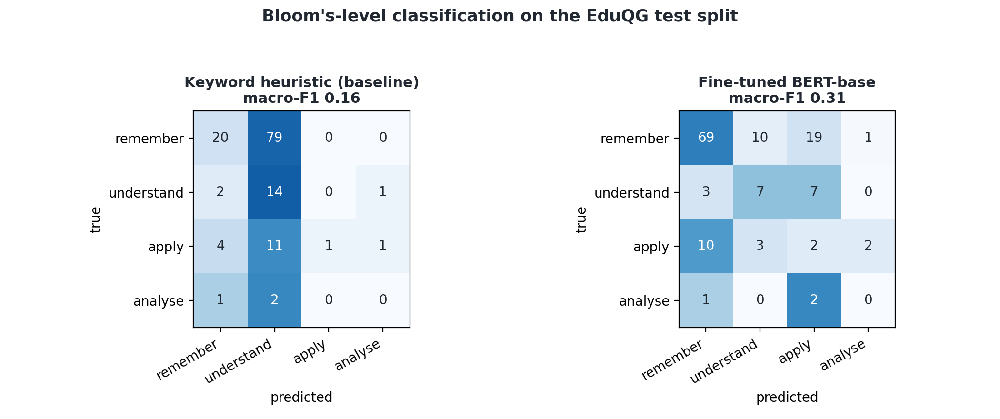
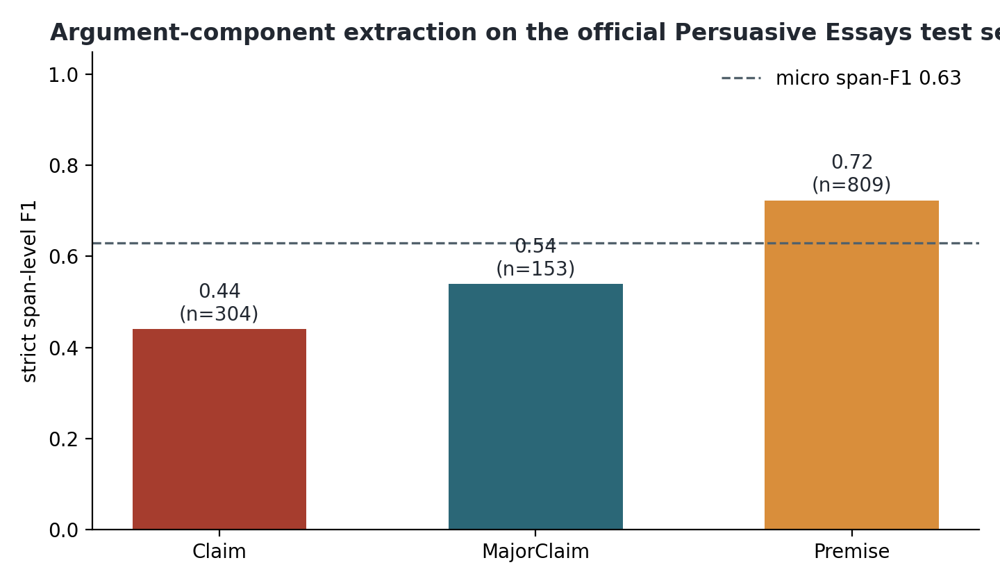

# Chapter 7: From a flag to verification questions

## 7.1 Why this is the point of the project

Detection on its own only produces a flag, and the earlier chapters showed how fragile a flag can
be out of domain. The actual contribution of the project is what happens after the flag: turning a
suspected submission into something a lecturer can act on fairly, which is a short set of questions,
drawn from the student's own claims, that check whether the student understands what they handed in.
A student who wrote and understood the work can answer them; a student who did not will struggle.
This chapter builds that step: a first thin slice end to end, then the trained components that
replace its stand-ins one by one, and the fine-tuning of the local backend.

## 7.2 How the slice works

The pipeline takes a flagged essay and produces a Verification Interview Guide
(`src/question_gen/generate_questions.py`). It runs in four steps.

First, it splits the essay into numbered sentences. Second, it extracts the student's main claims,
and for each claim it records the sentence numbers the claim comes from. This is the important
design choice for provenance: the model is asked to cite sentence numbers, not to quote the text, so
the source is looked up from the real numbered sentences and the model cannot invent a quote. Every
claim therefore points at exact lines in the submission. Third, for each claim it generates
verification questions that are grounded in the source sentences and written so that they cannot be
answered well by someone who only read the claim. Fourth, each question is tagged with a Bloom's
cognitive level.

Backends sit behind one interface. This first slice runs on the local open-source model (Llama 3.1
8B through Ollama), which is the basis for Backend B. The commercial Backend A plugs into the same
interface, and because the backend is recorded with every guide the two can be compared directly;
that comparison, the core commercial-versus-local research question, is carried out in Chapter 8.

## 7.3 An example

Run on a flagged essay that compares three literary texts, the system pulled out four claims and
wrote grounded questions for each. Two of them give the flavour.

For the claim that the three texts use language differently (metaphor and symbolism in the poetry,
dramatic intensity in the drama, subtle nuance in the prose), tied to two specific sentences in the
submission, it asked: "What specific features of Shakespeare's dialogue lead you to describe it as
having dramatic intensity?" and "How does Austen's subtle and nuanced prose style allow her to
explore complex social issues in a way that might be less effective with more overt language?" Both
need the student to reason about the text, not repeat the claim.

For the claim that the texts share themes of love and personal growth, tied to a single sentence, it
asked for an example from one of the texts that links personal growth to relationships, which is a
question a student who genuinely engaged with the texts can answer and a student who did not cannot.
The full guide, with every claim, its exact source sentences, and the Bloom's levels, is saved as
`outputs/verification_guides/3108a_ai.md`.

## 7.4 What was first-slice, and where each stand-in went

The slice above was deliberately a thin path through the remaining pipeline, with three declared
stand-ins, and it is worth recording what they were because the rest of this chapter replaces them
one by one. The claim extraction was prompted rather than the trained argument miner planned in the
scope; the trained extractor arrives in Section 7.6. The Bloom's tag was a transparent keyword
heuristic, replaced by the trained classifier in Section 7.5. And the questions themselves were not
yet evaluated; the discrimination simulation that turns them into measured results is the subject of
Chapter 8, where the commercial backend also joins the comparison. The one open decision at this
point, whether the local backend should be the full Llama 3 8B with QLoRA or a smaller model that
fits the laptop, was settled with my supervisor on the evidence of the fit probes and is picked up
in Section 7.8.

## 7.5 The Bloom's classifier: replacing the heuristic

The keyword heuristic above was always a placeholder, and component 5 of the scope is a trained
classifier. I fine-tuned BERT-base (Devlin et al., 2019) on the Bloom-labelled subset of EduQG
(Hadifar et al., 2022): 903
questions carrying a cognitive level, of which only four levels occur (remember, understand, apply,
analyse) in a heavily skewed distribution (660, 114, 110 and 19 examples respectively). Training used
class weights against that imbalance, stratified splits (632 train, 135 validation, 136 test), and six
epochs; the transparent keyword heuristic was scored on the same held-out test split as the baseline.

The trained model roughly doubles the heuristic: macro-F1 0.31 against 0.16, accuracy 0.57 against
0.26 (Figure 7.1). The per-class picture is the honest part. BERT is reliable on the majority class
(remember, F1 0.76) and moderate on understand (0.38), but it cannot learn apply (0.09) or analyse
(0.0) from 110 and 19 examples. Coarsening the same predictions into the standard lower-order versus
higher-order split does not rescue the minority side either: higher-order F1 is 0.23 for BERT and 0.17
for the heuristic, and the heuristic's apparently high binary accuracy (0.86) is majority-class bias
rather than skill, since predicting lower-order for everything scores about 0.85 on this test set.

Two conclusions follow. The component works and clearly beats the transparent baseline, so it replaces
the heuristic in the pipeline. And the labelled data, not the model, is the bottleneck: 73 percent of
EduQG's labels are the lowest level, so a classifier that must recognise higher-order questions needs
either more labelled examples of them or a coarser, better-populated label scheme. For the guide's
quality-control purpose the practical reading is that Bloom's tags on remember and understand
questions can be trusted, and tags on the higher levels should be treated as suggestions until the
label supply improves. Both the model and the full metrics are saved
(`models/bloom_classifier/`, `outputs/bloom_classifier.json`).

## 7.6 The trained claim extractor

The prompted claim extraction above was the declared stand-in for component 3, and the trained
version now exists. I downloaded the Persuasive Essays 2.0 corpus from its official repository (402
essays, BRAT annotations for major claims, claims, and premises, with the corpus's own 322/80
train/test split) and fine-tuned DeBERTa-v3-base as a BIO token classifier over the three component
types. Sequences are paragraphs, since no annotated component crosses a paragraph and the longest
paragraph fits inside 256 subwords, so nothing is truncated; evaluation is strict span-level
(exact boundary and exact type) with seqeval on the held-out test essays.

The result is a micro span-F1 of 0.63: premises 0.72, major claims 0.54, claims 0.44 (Figure 7.2).
Strict matching is a hard yardstick, and the per-class order is the expected one, since claim
boundaries are the classic ambiguity in this corpus. Dedicated argument-mining architectures with
CRF decoding or joint relation modelling report higher figures, so this is a working first version
rather than the state of the art, and I report it as such. For the pipeline it opens a design choice
to settle with my supervisor: the trained extractor finds spans in the student's own words, while the
prompted extractor produces readable claim paraphrases with sentence citations, so the natural
combination is spans for provenance and the prompt for phrasing. The model and metrics are saved
(`models/claim_extractor/`, `outputs/claim_extractor.json`).

## 7.7 The assembled guide: the pipeline's output document

With the classifier in place, the output assembler (`src/pipeline/assemble_guide.py`) now produces
the document the pipeline exists for: a Verification Interview Guide a lecturer can take into a
conversation. For a submission it runs the trained detector live and reports the probability with its
limits stated in plain language (the in-domain F1, the out-of-domain false-positive risk, and the
instruction to treat the score as a reason to talk, never as proof); it lists the SHAP-validated
drivers of decisions in lecturer-readable terms; it presents each extracted claim quoted to its exact
source sentences; it re-tags every question with the trained Bloom classifier, marking levels the
classifier is weak on as advisory; and it closes with a suggested three-level rubric for reading the
student's answers. The guide renders to Markdown, Word, and PDF
(`outputs/verification_guides/3108a_ai_guide.pdf` is the worked example, generated end to end with
live models). One design note carried through the document: the framing on the first page states that
the guide is evidence for a conversation, not an accusation, which is the position the fairness
results of Chapter 6 make necessary.

## 7.8 Fine-tuning the local backend: a result that looked too good

Section 7.4 left one question open for my supervisor: whether Backend B, the open-source side of the
core comparison, should be the full Llama 3 8B with QLoRA or a smaller model that fits the laptop. The
fit probes settled the practical half of it. In 4-bit with a LoRA adapter the 8B loads at 5.3 GB but
only trains by spilling past the physical 8 GB into system memory, at 214 seconds per step for a
1024-token sequence, whereas Qwen2.5 3B trains inside VRAM at 2.8 seconds per step with about 3 GB of
headroom (`outputs/qlora_fit_probe.json`). On the strength of those probes my supervisor signed off on
Qwen2.5 3B as Backend B on 3 July 2026, so the fine-tuning experiment runs on the 3B.

I fine-tuned Qwen2.5-3B-Instruct (Yang et al., 2024) with QLoRA (Dettmers et al., 2023;
`src/question_gen/finetune_qg.py`): 4-bit NF4 base, a LoRA adapter (rank 16; Hu et al., 2022) on
the attention projections, gradient checkpointing and a paged 8-bit
optimiser, batch 1 with gradient accumulation of 8, two epochs over 2,600 passage-to-question pairs
from EduQG. The prompt tokens are masked in the loss, so the model learns only to produce the
question. Training finished in under an hour on the 4060 at a final loss of 1.42, and the adapter is
saved to `models/qg_finetune_qwen3b/`.

The evaluation is built to isolate the fine-tuning effect and nothing else
(`src/question_gen/eval_finetune.py`). One fixed set of 18 claims was extracted once from six flagged
essays. The base Qwen 3B and the fine-tuned Qwen 3B each wrote verification questions for those same
claims, and both sets were scored by the same discrimination simulation used in Chapter 8. The only
thing that changes between the two conditions is the question-writing model, so any difference is the
adapter. The three phases never share the 8 GB: claims are extracted with the local model through
Ollama, which is then unloaded, each transformer model generates in turn, and scoring loads the
embedding model last.

On the raw metric the fine-tune looks like a triumph. The base model's questions score a mean
discrimination of 0.033 (95 percent CI 0.015 to 0.051); the fine-tuned model's score 0.154 (95 percent
CI 0.085 to 0.227), a Mann-Whitney p of 0.007 and confidence intervals that do not overlap (Figure
7.3). Taken at face value that is roughly a five-fold gain, and the same 0.15 shows up again at essay
scale in Section 8.8. I nearly wrote it up as the headline result of the whole project.

Reading the actual questions stopped that. The fine-tuned model had overfit the format of its training
data. EduQG is largely a multiple-choice corpus, and the adapter learned to emit multiple-choice
stems: about 95 percent of its questions are strings like "Which of the following is correct?" or
"Which of the following is not a reason why Peugeot is successful?", with no options ever supplied, and
a handful are raw JSON fragments leaking from the prompt. These are not verification questions at all.
A student could not answer them, and a lecturer could not use them. The full audit across all four
models is in Section 8.9, where the base 3B, the Llama 8B and the commercial model each produce zero
degenerate questions and the fine-tuned model produces almost only degenerate ones.

Worse, those empty stems are precisely what drove the score up. The literal string "Which of the
following is correct?" scores a mean discrimination of 0.44, higher than any real question from any
model. It does so because a contentless question defeats the simulation: the source-aware and the
source-blind answerer both receive a stem with nothing to answer, their responses diverge more or less
at random, and the aware-minus-blind gap the metric reports reflects that randomness, not any property
a real student would need the essay to satisfy. So the 0.154 measures how empty the fine-tuned model's
questions are, not how good they are. The honest conclusion is the opposite of the raw number: the
QLoRA fine-tune on EduQG failed as a question generator for this task.

I keep this in the dissertation rather than deleting it because the failure is informative twice over.
First, it shows that the training data's format matters more than its size: two epochs on an
overwhelmingly multiple-choice corpus was enough to collapse a capable instruct model into producing
multiple-choice stems, so the fix is not more data but the right data, a question-generation set of
open-ended questions (or the verification-style prompts themselves), which is the clear next experiment
for Backend B. Second, it exposes a real weakness in the discrimination simulation: the measure assumes
well-formed questions and can be gamed by degenerate ones, so it needs a well-formedness guard (a
simple filter, or the Bloom classifier, rejecting non-questions) before its scores are trusted. That
caution is exactly why the evaluation plan never rested on a single automatic metric, and Section 8.9
turns the episode into that methodological point.
