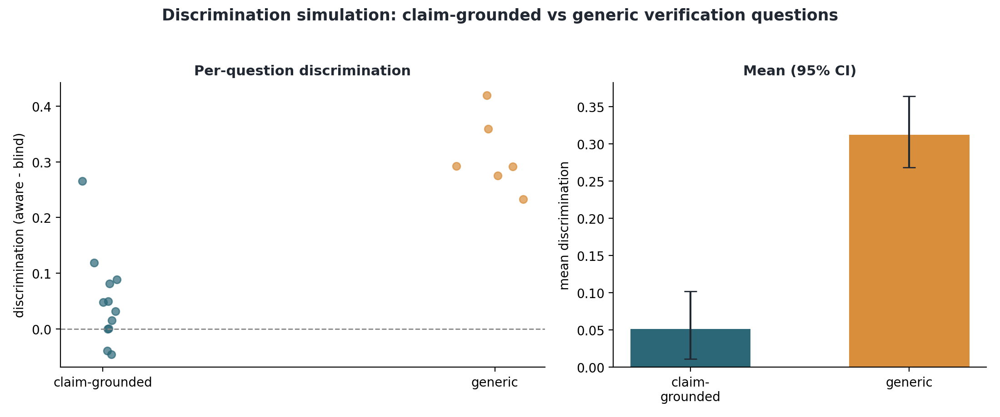
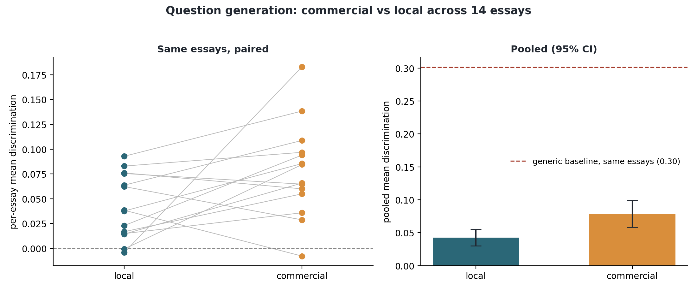

# Chapter 8: Evaluating the questions (discrimination simulation)

## 8.1 The idea

A good verification question is one that a student who understands their own work can answer and a
student who does not cannot. I evaluate that without humans or an LLM judge, using a discrimination
simulation (`src/evaluation/discrimination_sim.py`). For each question, one model answers it WITH
the source passage from the essay (the "context-aware" answer) and another answers it with the
question ONLY (the "context-blind" answer). I then measure how close each answer is to the source,
using embedding similarity (nomic-embed-text; Nussbaum et al., 2024), and take the gap, aware
minus blind, as the discrimination score. A high
gap means the question genuinely needs the source; a near-zero gap means it can be answered without
it. Everything runs on the local model and local embeddings, so the evaluation needs no API key and
no judge.

## 8.2 The result, which surprised me

I expected my claim-grounded questions to discriminate well. They did not. On the flagged essay,
the claim-grounded questions scored a mean discrimination of about 0.05 (95% confidence interval
[0.01, 0.10]), while a set of generic essay questions ("what is your main argument", "what evidence
most supports your conclusion", "explain your reasoning in your own words") scored about 0.31
([0.27, 0.36]). The intervals do not overlap, so the difference is real, and it is the opposite of
what I assumed (Figure 8.1).

## 8.3 Why, and what it means

The reason is the context-blind model. It is a large language model with broad world knowledge, so a
question that names specific content, "what features make Shakespeare's dialogue intense", is
answerable from general knowledge without ever reading this student's essay. The source barely
changes the answer, so the discrimination is low. A generic question like "what is the main argument
of your essay" is different: the blind model has no idea what this particular student argued, so its
answer is vague, while the source-aware model answers about the actual essay. The source matters a
lot, so the discrimination is high.

So the simulation is really measuring essay-specificity: does answering the question require this
student's own essay, or only knowledge of the subject. That reframes what a good verification
question is. It should force the student to reproduce their own argument, evidence, and choices,
rather than recite facts about the topic that anyone knowledgeable could supply. When I rewrote the
question-generation prompt to ask for the student's own reasoning and chosen evidence rather than
general facts, the grounded score did improve, from about 0.03 to about 0.05, but it stayed well
below the generic questions, because a specific question still tends to name the content and hand a
knowledgeable answerer most of what it needs.

## 8.4 A caveat about the stand-in

The context-blind model is a strong stand-in, with far more world knowledge than a student who used
AI without understanding the work. So a low discrimination score does not mean a question is useless
in practice; it means the question is answerable by a knowledgeable person who never read this essay.
The simulation is therefore a conservative, hard test of essay-specificity. A real student who did
not understand their submission would do worse than the blind model on the grounded questions, so the
true picture sits somewhere between the two lines in Figure 8.1.

## 8.5 What this changes

This is the first measured result for the question generation, and it is more useful as a finding
than a score. It says the strongest verification questions are the ones that make the student
retrieve and justify their own essay, its argument, the specific evidence they chose, and how their
points connect, rather than questions that restate subject facts. The next iteration of the
generator will blend the claim grounding (so each question is tied to a real passage) with this
retrieval-forcing style (so the answer cannot come from general knowledge). The remaining evaluation
step is the supplementary LLM-as-judge rubric with cross-model agreement as a second view; the two
steps promised here earlier, scaling the simulation across many essays and bringing in the commercial
backend, are reported next.

## 8.6 Commercial versus local: the first scaled comparison

With the simulation in place, I ran the comparison at the centre of the research question. ATU could
not provide API access or credits, so the commercial backend uses a free-tier Google Gemini API,
plugged in behind the same interface as the local model; the local backend is the same Llama 3.1 8B
used throughout. One disclosure on the commercial arm: free-tier quota limits forced a switch of
Gemini endpoint partway through (four essays ran on `gemini-2.5-flash`, ten on
`gemini-flash-latest`), so the commercial arm is one provider but not one fixed model snapshot. For
each essay in a seeded random sample, each backend generated a Verification Interview Guide (three
claims, grounded questions with sentence-level provenance), and every question from both backends was
scored by the same local discrimination simulation, so what varies is which model wrote the questions.

A small pilot on the single flagged essay from Section 8.2 came first: there, both backends' grounded
questions had discrimination intervals that included zero (local 0.032 with [-0.005, 0.083];
commercial 0.022 with [-0.002, 0.048]), too little signal to separate anything. The scaled run below
is the real comparison.

Fifteen essays were sampled; fourteen produced a scored guide from both backends (one essay was
excluded because claim extraction returned an empty guide; one commercial run was rate-limited for a
day and completed on retry), giving each backend 126 questions. The pooled means are local 0.042
with a 95% interval of [0.030, 0.055] against commercial 0.078 with [0.058, 0.098]. Because the same
essays sit under both backends, the fair test is paired: the commercial backend scores higher on 10
of the 14 essays, with a mean paired difference of 0.036, bootstrap interval [0.008, 0.067], paired
t-test p = 0.040, and Wilcoxon signed-rank p = 0.030. Unlike in the pilot, both pooled means sit
clearly above zero, so at this scale the grounded questions do measurably need the source
(Figure 8.2).

The plain reading is that the commercial backend holds a small but statistically significant
advantage on this measure, and that the local model remains competitive in absolute terms: the gap
is about 0.04 against a generic-question baseline of 0.30 with a 95% interval of [0.28, 0.32], now
re-measured on the same fourteen essays rather than taken from the pilot (84 generic questions; the
pilot's single-essay value of 0.31 held up almost exactly), and it comes from a base model that has
not yet been fine-tuned. Whether the planned QLoRA step closes that gap is exactly what the
fine-tuning experiment will test. The sample-size trajectory is itself worth recording: nine essays
showed no detectable difference, thirteen sat on the boundary (t p = 0.053), and the full fourteen
crossed it. Small-n snapshots of this comparison would have supported whichever story one preferred,
which is why the dissertation reports the complete set with paired tests. The remaining caveats
stand: the discrimination measure is conservative, both backends sit well below the generic-question
baseline, and the commercial arm is one provider's free tier rather than a frontier model. Extending
the comparison to more essays, more providers, and the fine-tuned local backend is mechanical from
here, since the framework saves per essay and resumes.

## 8.7 LLM-as-judge: three judges, anchored, and the anchoring was needed

The supplementary evaluation puts LLM judges over the questions with the four-dimension rubric
(relevance, specificity, discrimination potential, cognitive appropriateness, each 1 to 5), and the
plan has always been to validate judges rather than trust them. All three judges the scope calls for
have now rated the twelve grounded questions from the pilot guide: Gemini (2.5 Flash, free tier),
Claude (Opus 4.8) and GPT (4o-mini), the last two on a small capped spend approved by my supervisor
(`src/evaluation/llm_judge.py`, resumable across quota interruptions; results and the agreement
statistics in `outputs/llm_judge.json`).

The three judges do not tell one story, and that is the finding. Gemini and GPT both sit at the
ceiling: Gemini rates everything 4.5 to 5.0 (mean 4.81) and GPT even tighter, 4.75 to 5.0 (mean
4.94), so their scores mostly say the questions look well-formed. Claude behaves differently, using
the scale from 2.5 to 4.5 (mean 3.67) and marking down exactly the content-naming questions such as
"how does the metaphor evoke longing", which general knowledge can answer. Cross-model agreement,
the scope's own validation criterion, is therefore poor: Krippendorff's alpha across the three
judges is -0.25, and no pairwise rank correlation reaches significance (Spearman 0.20 to 0.45, all
p > 0.13). Two judges at a ceiling cannot agree with a third that discriminates.

The anchoring to the objective measure settles what the disagreement leaves open. None of the three
judges correlates positively with the discrimination simulation on the same questions: Gemini's mean
rating sits at rho -0.14 (p = 0.67), Claude's at -0.30 (p = 0.34), and GPT's near-constant ratings
manage a significantly negative rho of -0.75 (p = 0.005), meaning the few questions it rated below
the ceiling were among the ones that objectively discriminate best. With n = 12 the individual
correlations deserve caution (an earlier partial run of the first judge looked strongly negative at
seven questions and attenuated to nothing by twelve), but the pattern across three independent
providers is consistent: rubric ratings measure how good a question looks, not how well it separates
someone who read the essay from someone who did not.

The conclusion for the evaluation design is the one the plan anticipated, now with evidence rather
than caution behind it. Judge scores in this setup cannot certify question quality on their own,
because the judges neither agree with each other nor track the objective measure; the judge-free
discrimination simulation carries the empirical weight, and the judge panel's value is exactly this
negative result. It is also a second, independent instance of the project's central methodological
lesson from Section 8.9: a plausible-looking automatic score, whether a judge rating or a
discrimination number, means nothing until it is checked against something that cannot be gamed.

## 8.8 Like-for-like: the four writers on one fixed claim set

Section 8.6 compared the backends but let each one run its whole pipeline, so the model that chose the
claims differed between arms as well as the model that wrote the questions. That leaves an ambiguity:
the commercial edge there could come from writing better questions, or simply from Gemini selecting
claims that happen to discriminate more. This section removes the ambiguity. One claim set is fixed
per essay, extracted once with the neutral local extractor (Llama 3.1 8B), and four question writers
answer the same claims: Llama 3.1 8B, free-tier Gemini, the base Qwen2.5 3B, and the QLoRA-fine-tuned
Qwen2.5 3B. Every question is scored by the same discrimination simulation, so the only variable
across the four arms is the model that writes the question (`src/evaluation/likeforlike_4way.py`,
`outputs/likeforlike_4way.json`). The 14 essays are the balanced set from Section 8.6.

On the discrimination score the ordering looks dramatic (Figure 8.3). The fine-tuned 3B reaches a
pooled mean of 0.153 (95% CI [0.105, 0.202]), far above the base 3B at 0.041 [0.028, 0.055], Llama 8B
at 0.031 [0.016, 0.045], and commercial Gemini at 0.024 [0.008, 0.041]. Its paired lead is 0.138 over
commercial (p < 0.001) and 0.123 over its own base (p < 0.001), and it reproduces the 0.154 from
Section 7.8. Read at face value, the locally fine-tuned open model does not merely match the commercial
one, it buries it.

That reading does not survive looking at the questions, and Section 8.9 is given over to why: about 95
percent of the fine-tuned model's questions are degenerate multiple-choice stems that game the
simulation, so the 0.153 measures how empty they are, not how good. The fine-tuned arm is therefore set
aside for the interpretation here, and the honest comparison is among the three models whose questions
are well-formed.

Among those three the picture is modest and close. On the fixed claims the three models are
statistically indistinguishable: base Qwen 3B at 0.041, Llama 8B at 0.031, and Gemini at 0.024, all low
and with overlapping intervals. The run initially covered only 9 of 14 essays on the commercial arm
because free-tier quota ran out mid-run; the framework resumed when quota returned, and the numbers
here are the complete set (105 commercial questions across all 14 essays, a few claims lost to
rate-limiting inside otherwise-covered essays). The complete set settles what the partial one could
only suggest. In Section 8.6, with each backend choosing its own claims, Gemini held a significant edge
over Llama 8B (0.078 to 0.042, paired p = 0.040); here, on identical claims, that edge is simply gone
(paired difference -0.005, p = 0.62, Gemini higher on seven of fourteen essays, a coin flip). So the
Section 8.6 advantage does not survive fixing the claims. The reading I take is that it came
substantially from claim selection, Gemini choosing easier-to-discriminate claims when allowed to,
rather than from writing stronger questions on the same ones; the design here cannot rule out every
alternative, but the disappearance itself is now measured on the full sample, not hypothesised. The
firm conclusion of this section is narrower than the one I first drafted and arguably more useful: when
the task is fixed, small open models running on a laptop write questions as discriminative as a
commercial model's, while the second half of the research question, whether a fine-tuned local model
can beat a commercial one, stays open at this point in the story, because the fine-tune that was
supposed to answer it produced unusable questions.

## 8.9 The fine-tuned model games the metric: a quality audit

The previous section leaned on a number without reading what it scored. This section does the reading,
because the gap between the two is the most important methodological lesson in the project
(`src/evaluation/qg_quality_audit.py`, `outputs/qg_quality_audit.json`). Every question from all four
arms was checked with a transparent rule for degeneracy: multiple-choice stems (which never carry
options here), raw JSON fragments leaking from the prompt, and contentless "which is correct" forms.

The result is stark (Figure 8.4). The Llama 8B, base 3B and commercial arms produce no degenerate
questions at all. The fine-tuned 3B produces almost nothing else: 59 of its 62 questions, just over 95
percent, are stems like "Which of the following is correct?" or "Which of the following is not a reason
why Peugeot is successful?", with no options supplied. The fine-tune, two epochs on the largely
multiple-choice EduQG corpus, had overfit the format of the training data and forgotten how to write an
open question. None of these are usable in a verification interview.

The second panel is the part that matters for the evaluation method. Those empty stems do not merely
survive the discrimination simulation, they win it. The single literal string "Which of the following
is correct?", scored eleven times across the run, averages a discrimination of 0.44, higher than the
mean of every model's real questions. The reason is structural: a contentless question gives the
source-aware answerer and the source-blind answerer nothing to latch onto, their answers wander apart
for reasons unrelated to the source, and the aware-minus-blind gap the metric rewards is large. The
discrimination simulation, in other words, silently assumes the questions it scores are well-formed,
and a degenerate generator can exploit that assumption to post an arbitrarily high score.

Two conclusions follow, and both are more useful than the false headline they replace. For Backend B,
the lesson is that the training data's format dominates: fixing the fine-tune means not more data but
the right data, an open-ended question-generation set (SQuAD-style questions, or the pipeline's own
verification prompts distilled into training pairs) rather than a multiple-choice corpus, and that is
the next experiment, carried out in Section 8.10. For the evaluation, the lesson is that the judge-free
discrimination simulation, valuable as it is for well-formed questions, needs a well-formedness gate in
front of it, and that no automatic score should be read without inspecting the text behind it. That
gate is now part of the pipeline (`src/question_gen/wellformed.py`): the same transparent rule the
audit uses is applied wherever questions leave the system, the guide builder drops malformed questions
before a lecturer can see them and records how many it dropped, and every fine-tune evaluation reports
its degeneracy rate next to its score. That is precisely the discipline the evaluation plan was built
on, which is why this failure was caught here rather than in a viva.

## 8.10 Fixing the fine-tune: v2 on open-ended data

Section 8.9 made a testable prediction: if the degeneracy was caused by EduQG's multiple-choice format,
then changing only the training data to open-ended questions should fix it. So I re-ran the fine-tune
with everything held identical except the data, swapping EduQG for SQuAD (Rajpurkar et al.,
2016), whose questions are
open-ended and passage-grounded (`src/question_gen/finetune_qg_v2.py`, adapter in
`models/qg_finetune_qwen3b_v2/`). The evaluation repeats the Section 7.8 design on the same 18 claims,
base against the new adapter, and it audits degeneracy before reading any score
(`src/question_gen/eval_qg_v2.py`, `outputs/qg_v2_eval.json`).

The prediction holds, cleanly. The v2 model's questions are 0 percent degenerate against v1's 95, so
the format of the training data was indeed the cause, not fine-tuning as such (Figure 8.5). And this
time the discrimination gain is real rather than an artifact, because the questions are well-formed. On
the same claims, v2 scores a mean discrimination of 0.102 (95% CI [0.060, 0.144]) against the base
model's 0.027 ([0.015, 0.040]), a Mann-Whitney p of 0.0003. The contrast with v1 is the whole point:
v1's higher 0.154 was empty multiple-choice stems gaming the metric, while v2's lower 0.102 is genuine
questions that genuinely need the source more than the base model's do.

I hold the reading to what was measured, because v2 is a partial success, not a triumph. Its 0.102 is
well under the generic-question baseline of about 0.30, and reading its questions shows why: SQuAD
trains a factual style ("What is the purpose of judicial review?"), and factual questions are partly
answerable from general knowledge, which is exactly the property Section 8.3 showed the simulation
penalises. Two smaller points round out the honesty. v2 needed a cleaned output parser, because the
adapter sometimes appended JSON fragments after the question that an earlier extractor would have kept;
the parser now takes the first well-formed question and drops the rest. And the degeneracy audit ran
before the score, as the standing rule now requires. The overall arc is the useful result: fine-tuning
a small local model does help once the training data has the right form, but SQuAD's factual questions
are not the ideal signal for verification, so the genuinely next step is a training set of
reasoning-demanding questions, distilled from the pipeline's own verification prompts, which is the v3
experiment of the next section. That is where the arc stood before its final leg: a diagnosed and
half-fixed component, reported honestly rather than as the false win of Section 7.8's first draft.

## 8.11 Completing the data-format experiment: v3 on the pipeline's own style

The third leg trains on data in exactly the format the task wants. A training set of 2,604
verification questions was distilled from the pipeline itself (`src/question_gen/build_v3_dataset.py`):
the local Llama 3.1 8B ran the production claim-extraction and question-writing prompts over 307
training essays, and each well-formed question became one passage-to-question pair, with the passage
being the claim plus its source sentences, which is what the model sees at inference. Three
precautions mattered. All fifteen evaluation essays were excluded from the training pool, so nothing
the fine-tunes are tested on was ever trained on. Only questions passing the well-formedness gate
became training targets, since a noisy teacher would poison the experiment. And Llama's licence
permits training other models on its output, which is why the teacher is local rather than a
commercial API. Training kept every setting identical to v1 and v2 once again
(`src/question_gen/finetune_qg_v3.py`); the final loss of 0.72, against 1.42 for v1 and 1.27 for v2,
already hints that on-format data is simply easier to learn.

The evaluation follows the standing protocol: degeneracy audited before any score, same 18 fixed
claims (`src/question_gen/eval_qg_v3.py`, `outputs/qg_v3_eval.json`). v3 is fully well-formed, zero
degenerate questions out of 42, and it answers the request for three questions per claim far better
than v2 did (2.3 per claim against 1.3). Its output finally reads like the pipeline's design language:
"How did you decide to use the example of a decision made by a public authority as evidence", "what
role does the concept of authority play in your argument, and how did you connect it", "in what ways
does your discussion relate to the broader themes of your essay". On the metric it lands at a mean
discrimination of 0.064 (95% CI [0.033, 0.096]), roughly two and a half times the base model's 0.027
([0.015, 0.040]), with the intervals barely brushing; notably that also doubles the 8B teacher's own
score in the fixed-claim comparison (0.031, Section 8.8), so the 3B student overtook the model that
taught it (Figure 8.6).

The result that resists a tidy ranking is that v2 still posts the higher number (0.102 against 0.064),
and saying why matters more than the numbers themselves. The two adapters learned different trades.
v2 writes one terse factual question per claim; that style happens to suit the simulation, but "What
is the purpose of judicial review?" is not a verification question, since it never asks the student
about their own essay. v3 writes the questions the product actually needs, demanding the student's
reasoning, choices and connections, but in doing so it quotes the claim's content back, and Section
8.3 established that handing content to the source-blind answerer shrinks the measured gap. So the
metric, taken alone, would pick the adapter whose output is unfit for purpose. This is the third time
in this chapter a single automatic number pointed the wrong way (after the v1 artifact and the judge
panel), and it is why the decision about Backend B is not delegated to the metric: v3 becomes the
working local backend on the grounds that its output is well-formed, on-style and a real improvement
over base, with v2's higher raw score documented and explained rather than chased.

What the completed experiment establishes is worth stating cleanly, because it is the dissertation's
answer on fine-tuning. Format dominates: a multiple-choice corpus collapses the model, and either
open-ended format fixes it. Fine-tuning a 3B model on an 8 GB laptop reliably lifts it well clear of
its base, whichever open format is used, and self-distillation can lift a small student past its own
larger teacher on the target measure. And no single automatic score, not this one and not a judge's,
is allowed to settle a design decision by itself in this project.
