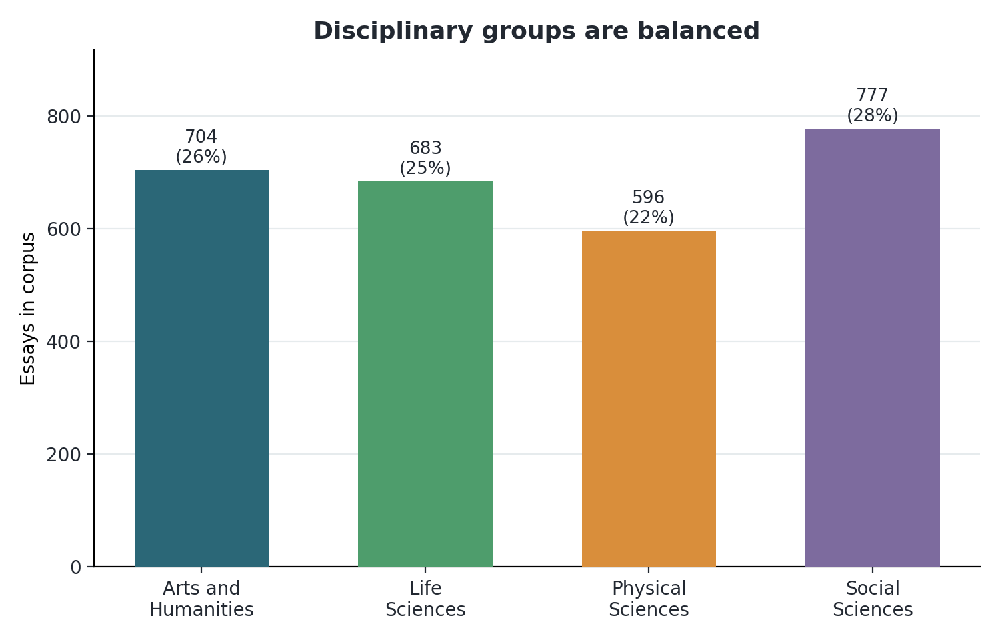
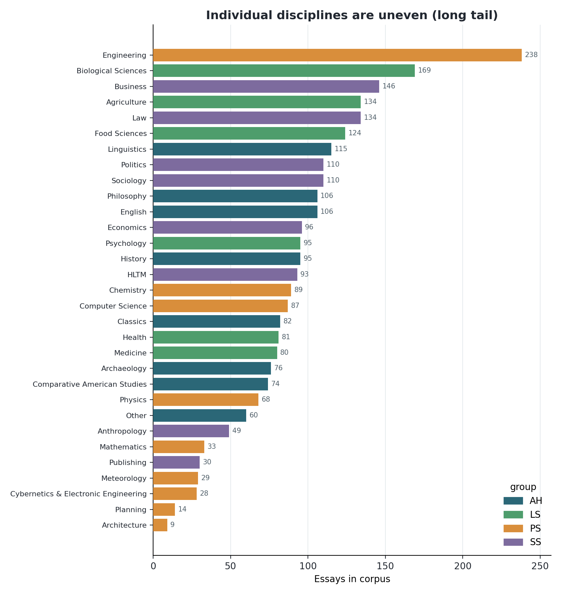
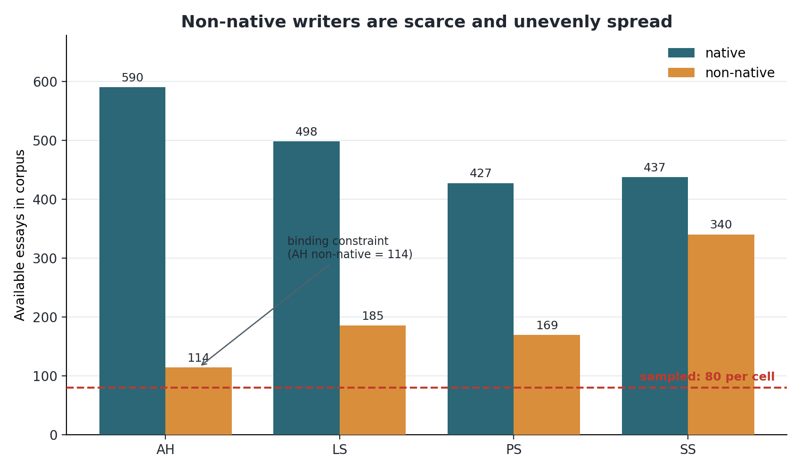
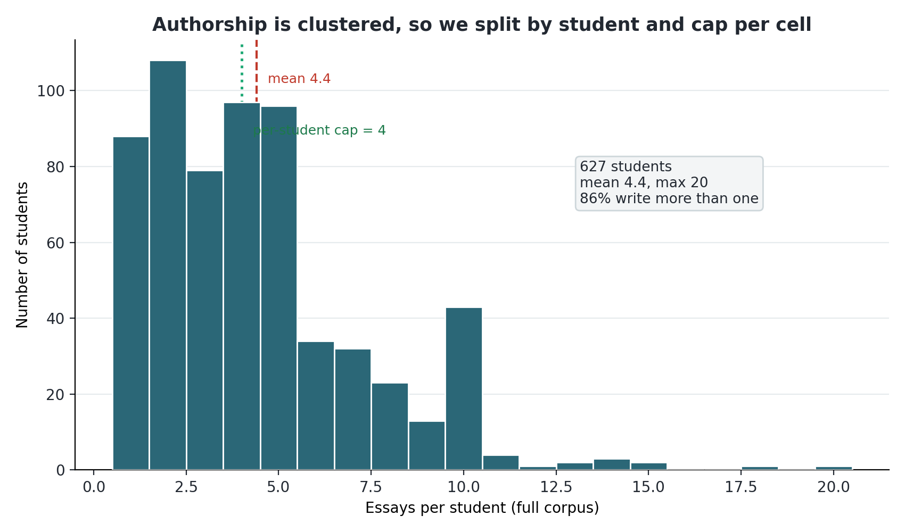
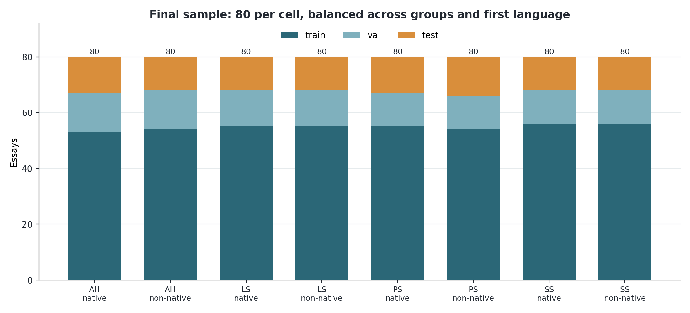
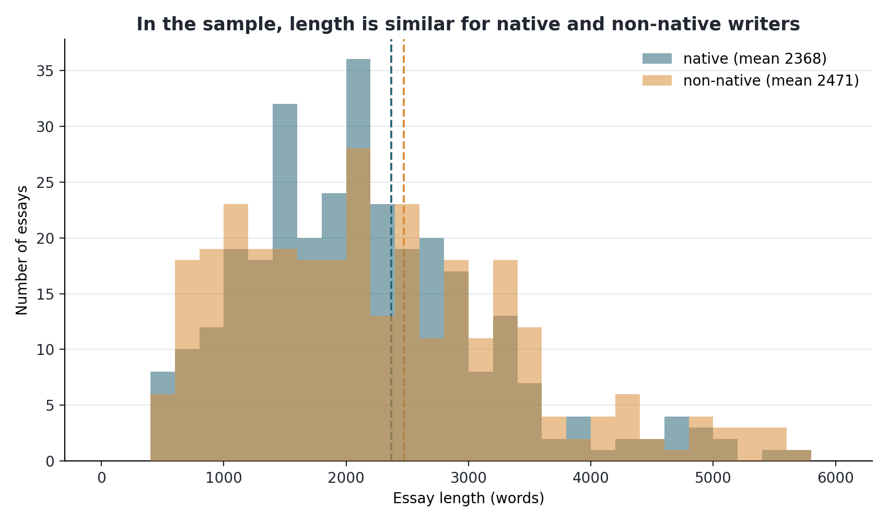

# Dataset rationale, with figures

This is the visual companion to `sample_design.md`. It walks through the dataset
decisions and shows the evidence behind each one. The figures are generated by
`dissertation/presentation/make_dataset_figures.py` and saved in
`dissertation/figures/`.

The human corpus is BAWE (2,761 real UK student essays, cleaned to 2,760). The AI
half is built later by generating a matched AI version of each human essay. The
detector is trained on the two halves to tell Human from AI (two classes).

## Decision 1: stratify by disciplinary group, not by named discipline

BAWE sorts every essay into one of four broad groups and also into a specific
discipline. The groups are close to even in size.

The individual disciplines are not even at all. Engineering has 238 essays,
Architecture has 9, and there is a long tail in between. The colours show that
each group is itself made of several disciplines.

So if I sampled by named discipline I would either be forced into tiny per
discipline quotas (capped by Architecture at 9) or I would let a few big
disciplines dominate. Sampling by group avoids both. It gives a balanced spread
across the four broad areas of study, and the discipline mix inside each group
falls out naturally. This is why the stratification key is the group, not the
discipline.

## Decision 2: oversample non-native writers, and why Arts and Humanities binds

In the full corpus, 71% of essays are by native English speakers and 29% by
non-native speakers, and the non-native essays are spread unevenly across the
groups.

Two things follow. First, detector bias against non-native writers is a known
problem in this field, so I want enough non-native essays to measure it. Taking
an even 80 per cell pushes the non-native share from its natural 29% up to 50%,
which gives equal-precision comparisons between native and non-native. Second,
the red line at 80 shows the quota is reachable in every cell, but Arts and
Humanities non-native (114 essays) is the tightest. That cell is the binding
constraint on how large an even, balanced sample can be, which is the main reason
the per-cell size is 80 rather than larger.

## Decision 3: split by student, and cap each student per cell

BAWE is written by 627 students, and most of them contributed several essays. The
mean is 4.4 per student and one student wrote 20.

That clustering is a trap for a detector. If the same person's essays sit in both
the training and the test set, the model can learn that individual's style and
look more accurate than it really is. So train, validation and test are split at
the student level (no writer appears in two splits), and within each cell I keep
at most four essays per student so no single writer dominates a class. About 5% of
students have essays in more than one group, so the split is assigned globally,
not cell by cell.

## The resulting design

The sample is 640 essays: eight cells of 80, even across the four groups and
50/50 native to non-native. Each cell is then split roughly 70/15/15 by student.

Every bar is exactly 80, which is the balance the design is aiming for. The split
proportions wobble a little between cells because whole students are assigned
together, which is the price of having no writer leak across splits.

## Decision 4: control for length

Length is the confound that would quietly ruin the project. If AI essays were
systematically longer or shorter than human ones, the detector would learn length
and ignore style. There are two defences.

The main one is at generation time: each AI essay is written to match the length
(and topic and keywords) of its specific human source, so the Human versus AI
label can never be separated by length. That is built when the AI half is
generated.

The second is in the human sample itself. Because native and non-native essays
sit in equal-sized cells, length does not line up with first language either. The
two distributions overlap almost completely and the means are close (2,368 versus
2,471 words).

## Decisions at a glance

| Decision | Why |
|----------|-----|
| Stratify by group, not discipline | groups are balanced, disciplines are not |
| 80 per cell, 50/50 native to non-native | oversample non-native for a bias analysis; 80 is the most the scarce AH non-native cell supports with a margin |
| Per-student cap of 4 | stop one writer's style dominating a class |
| Split by student, globally | no writer leaks across train, validation and test |
| Match AI length, topic and keywords | force the detector to learn style, not length or topic |
