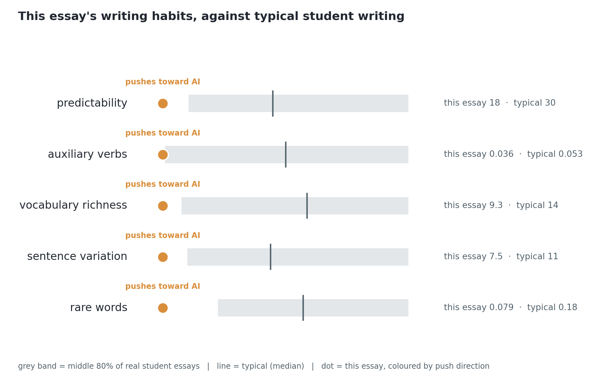

# Verification Interview Guide

**Submission:** 3108a  |  **Generated:** 2026-07-13  |  **Question backend:** local-hf:v3:qg_finetune_qwen3b_v3

> This guide is evidence for a conversation with the student, not an accusation. The detector's judgement is fallible, and the fair use of this document is to ask, listen, and weigh the answers.

## 1. Detection summary

The hybrid detector (transformer fused with stylometric features and GPT-2 perplexity) scores this submission at **0.9572** probability of being AI-generated, so it is **flagged as likely AI-generated**. No score of 1.0 exists on this scale: the model is never certain, only confident. On matched in-domain test data the detector's F1 is 0.99; on out-of-domain academic text its false-positive rate rises sharply, so treat the score as a reason to talk, never as proof.

*Component views: transformer 0.9996, style-plus-perplexity 0.9985. The hybrid fuses both because the style half keeps the detector calmer on unusual but human writing.*

**Why this particular score? The habits that moved it, against typical student writing:**

- A language model finds this text easier to predict than typical (surprise score 18 against 30), which here points toward AI.
- Fewer helper verbs (is, has, can) than typical (0.036 against 0.053), which here points toward AI.
- The overall word variety is lower than typical (9.3 against 14.0), which here points toward AI.
- The sentences are unusually uniform in length (variation 7.5 against a typical 11.4), which here points toward AI.
- Fewer one-off, unusual words than typical (0.08 against 0.18), which here points toward AI.

**What drives decisions like this one** (validated by faithfulness testing):

- Average word length: consistently longer words push a text toward the AI class.
- Vocabulary richness: a wider, less repetitive vocabulary pushes toward the human class.
- Sentence-length variation: humans vary sentence length more; uniform sentences look AI-written.
- Auxiliary-verb and determiner densities: small grammatical habits that differ between the classes.

## 2. The student's claims and where they come from

Each claim below is phrased for readability, then anchored two ways so nothing here is invented: to the exact sentence numbers it was drawn from, and to the verbatim argument spans the trained argument miner found in those sentences, each labelled by its role (major claim, claim, or premise). Every question can be traced to the student's own words.

### Claim 1: The three texts (Dickinson's poetry, Shakespeare's Othello, and Austen's Emma) represent distinct literary genres but share certain commonalities in their exploration of universal themes and ideas.

**Source in the submission (cited sentences):**

> [1] These three texts represent distinct literary genres: poetry, drama, and prose fiction respectively.
> [27] Despite these differences, all three texts share certain commonalities.
> [31] These texts represent distinct literary genres but share certain commonalities in their exploration of universal themes and ideas.

**Argument spans found by the trained miner (verbatim, in the student's words):**

- *Claim:* “all three texts share certain commonalities”
- *Premise:* “Whether through their exploration of universal themes and ideas or their treatment of female characters and historical context, these texts continue to inspire and captivate readers today”
- *Claim:* “these texts also highlight the significance of literary genres and styles in conveying meaning”

**Verification questions:**

- How did you decide which aspects of the texts shared commonalities?  *(Bloom: remember)*
- What particular themes and ideas in the texts led you to conclude that they share commonalities?  *(Bloom: apply (advisory))*
- In what ways does the connection between these commonalities and the rest of your essay contribute to its overall argument?  *(Bloom: apply (advisory))*

### Claim 2: Language is used differently across the three texts to convey meaning and evoke emotions, with Dickinson's poetry relying on metaphor and symbolism, Shakespeare's dialogue being dramatic and intense, and Austen's prose being subtle and nuanced.

**Source in the submission (cited sentences):**

> [21] Dickinson's poetry relies on metaphor and symbolism to evoke emotions and ideas, whereas Shakespeare's dialogue is characterized by its dramatic intensity and emotional depth.
> [22] Austen's prose, meanwhile, employs a more subtle and nuanced style to explore the complexities of relationships and social class.
> [25] Shakespeare's Othello follows a more conventional dramatic structure, with its emphasis on character development and tragic conflict.

**Argument spans found by the trained miner (verbatim, in the student's words):**

- *Premise:* “The dialogue between the two characters is characterized by its intensity and conviction”
- *Premise:* “Dickinson's poetry relies on metaphor and symbolism to evoke emotions and ideas, whereas Shakespeare's dialogue is characterized by its dramatic intensity and emotional depth”
- *Premise:* “Austen's prose, meanwhile, employs a more subtle and nuanced style to explore the complexities of relationships and social class”
- *Premise:* “Shakespeare's Othello follows a more conventional dramatic structure, with its emphasis on character development and tragic conflict”
- *Premise:* “These portrayals highlight the ways in which Austen uses language to explore the complexities of social class”
- *Premise:* “Shakespeare's Othello, for example, follows a traditional dramatic structure with its emphasis on character development and tragic conflict”
- *Premise:* “Shakespeare's Othello, for example, provides a powerful commentary on the dangers of unchecked jealousy and deceit, while Austen's Emma offers a nuanced exploration of social class and relationships”
- *Premise:* “Shakespeare's Othello features a dramatic structure with multiple plot threads and subplots, whereas Austen's Emma follows a more linear narrative with a clear beginning, middle, and end”
- *Claim:* “Austen's Emma, meanwhile, portrays a range of characters navigating complex social relationships”

**Verification questions:**

- How does the use of metaphor and symbolism in Dickinson's poetry relate to her overall argument about language and meaning in the text?  *(Bloom: apply (advisory))*
- What choice did you make in connecting Shakespeare's dialogue to his dramatic structure, and why was this a relevant point for your analysis?  *(Bloom: understand)*
- In what ways do you think Austen's subtle and nuanced prose contributes to our understanding of the complexities of relationships and social class in the text?  *(Bloom: understand)*

### Claim 3: The treatment of female characters in the three texts varies significantly, with Dickinson's poetry often featuring women as figures of inspiration and guidance, Shakespeare's Othello featuring a woman who is ultimately destroyed by her husband's jealousy, and Austen's Emma portraying complex and multidimensional female characters.

**Source in the submission (cited sentences):**

> [44] Dickinson's poetry often features women as figures of inspiration and guidance, whereas Shakespeare's Othello features a woman who is ultimately destroyed by her husband's jealousy.
> [49] Austen's Emma, meanwhile, features a range of female characters who are complex and multidimensional.
> [50] For example, Harriet Smith is portrayed as a young woman struggling to navigate her social relationships, while Emma Woodhouse is depicted as a confident but ultimately flawed protagonist.

**Argument spans found by the trained miner (verbatim, in the student's words):**

- *Premise:* “Austen's Emma, meanwhile, features a more complex narrative with multiple plot threads and subplots”
- *Premise:* “Dickinson's poetry often features women as figures of inspiration and guidance, whereas Shakespeare's Othello features a woman who is ultimately destroyed by her husband's jealousy”
- *Premise:* “Austen's Emma, meanwhile, features a range of female characters who are complex and multidimensional”
- *Premise:* “Harriet Smith is portrayed as a young woman struggling to navigate her social relationships, while Emma Woodhouse is depicted as a confident but ultimately flawed protagonist”
- *Premise:* “Austen's Emma, meanwhile, features a range of characters who are shaped by their social status and class”
- *Premise:* “Dickinson's poetry often features women as figures of inspiration and guidance”
- *Premise:* “Mr. Elton is portrayed as a man who is obsessed with his own social standing, while Harriet Smith is depicted as a young woman struggling to navigate her social relationships”
- *Premise:* “Shakespeare's Othello features a dramatic scene where language is used to manipulate and deceive, whereas Austen's Emma portrays a range of characters navigating complex social relationships”
- *Claim:* “Austen's Emma, meanwhile, portrays a range of characters navigating complex social relationships”

**Verification questions:**

- How did you decide which aspects of each text's portrayal of female characters were most relevant to your argument?  *(Bloom: apply (advisory))*
- What role does Emma Woodhouse play in Austen's Emma, and how does this character connect to the rest of your essay?  *(Bloom: analyse (advisory))*
- In what ways do you think the portrayal of female characters in Dickinson's poetry differs from the others, and how does this inform your overall argument?  *(Bloom: understand)*

### Claim 4: The three texts demonstrate varying levels of historical and cultural context, with Shakespeare's Othello being set against the backdrop of Venetian society in the early 16th century, Dickinson's poetry reflecting her own experiences as a recluse in rural New England, and Austen's Emma featuring characters shaped by their social status and class.

**Source in the submission (cited sentences):**

> [53] Shakespeare's Othello, for example, is set against the backdrop of Venetian society in the early 16th century, while Dickinson's poetry reflects her own experiences as a recluse in rural New England.
> [92] Shakespeare's Othello is set against the backdrop of Venetian society in the early 16th century, whereas Dickinson's poetry reflects her own experiences as a recluse in rural New England.
> [93] Austen's Emma, meanwhile, features a range of characters who are shaped by their social status and class.

**Argument spans found by the trained miner (verbatim, in the student's words):**

- *Premise:* “Austen's Emma, meanwhile, features a range of female characters who are complex and multidimensional”
- *Premise:* “Shakespeare's Othello, for example, is set against the backdrop of Venetian society in the early 16th century, while Dickinson's poetry reflects her own experiences as a recluse in rural New England”
- *Premise:* “Austen's Emma, meanwhile, features a range of characters who are shaped by their social status and class”
- *Premise:* “Shakespeare's Othello features a dramatic scene where language is used to manipulate and deceive, whereas Austen's Emma portrays a range of characters navigating complex social relationships”
- *Claim:* “Austen's Emma, meanwhile, portrays a range of characters navigating complex social relationships”
- *Premise:* “Shakespeare's Othello is set against the backdrop of Venetian society in the early 16th century, whereas Dickinson's poetry reflects her own experiences as a recluse in rural New England”

**Verification questions:**

- How did you decide to use Shakespeare's Othello as an example of historical context?  *(Bloom: understand)*
- What evidence from Dickinson's poetry do you think best supports your claim that it reflects her own experiences as a recluse in rural New England?  *(Bloom: understand)*
- In what ways do you think the social status and class of characters in Austen's Emma connect to the rest of your essay?  *(Bloom: analyse (advisory))*

## 3. Suggested marking rubric for the conversation

| Level | What you hear | Suggested reading |
|---|---|---|
| Strong | Reconstructs the claim, names their evidence, extends it unprompted | Understanding demonstrated; the flag is likely a false positive or the tool use was superficial |
| Partial | Recalls the claim but cannot say why the evidence supports it | Mixed picture; consider a follow-up task on the weak areas |
| Weak | Cannot restate their own claim or where it came from | Understanding not demonstrated; proceed per your institution's academic-integrity process |

*Bloom tags above `understand` are marked advisory: the trained classifier is reliable on lower levels and under-trained on higher ones (see the technical report). The tags order the questions from recall to reasoning; start low, move up.*
